The **AppOwnsDataMultiTenant** application is a sample .NET 6
application which demonstrates how to design an App-Owns-data
application using the **service principal profiles** feature introduced
in the Power BI Service in March of 2022. This article explains how
service principal profiles can be used to design and implement a
large-scale, multitenant environment for Power BI embedding with
10,000's or 100,000's of customer tenants.

This article will began with a quick primer on developing multitenant
application using App-Owns-Data embedding. This primer will allow the
reader to better understand the problems that service principal profiles
were created to solve. Next, this article will introduce service
principal profiles and explain how they can be used to improve
performance, scalability and security in a multitenant application that
has been developed using App-Owns-Data embedding.

The article also contains step-by-step instructions to set up the
**AppOwnsDataMultiTenant** application to get it up and running in a
Power BI development environment.

# Table of Contents

[Developing Multitenant Applications for App-Owns-Data Embedding
[2](#_Toc99115108)](#_Toc99115108)

[Understanding the 1000 Workspace Limitation
[2](#understanding-the-1000-workspace-limitation)](#understanding-the-1000-workspace-limitation)

[Managing Isolation for Datasets and Datasource Credentials
[3](#managing-isolation-for-datasets-and-datasource-credentials)](#managing-isolation-for-datasets-and-datasource-credentials)

[Design Strategies Before Service Principal Profiles
[4](#design-strategies-before-service-principal-profiles)](#design-strategies-before-service-principal-profiles)

[Introduction to Service Principal Profiles
[5](#introduction-to-service-principal-profiles)](#introduction-to-service-principal-profiles)

[Service Principal Profiles are Power BI Security Principals
[6](#service-principal-profiles-are-power-bi-security-principals)](#service-principal-profiles-are-power-bi-security-principals)

[Executing Power BI REST API Calls as a Service Principal Profile
[6](#executing-power-bi-rest-api-calls-as-a-service-principal-profile)](#executing-power-bi-rest-api-calls-as-a-service-principal-profile)

[Using the Profiles API to create and manage service principal profiles
[7](#using-the-profiles-api-to-create-and-manage-service-principal-profiles)](#using-the-profiles-api-to-create-and-manage-service-principal-profiles)

[Getting Started with the **AppOwnsDataMultiTenant** application
[10](#getting-started-with-the-appownsdatamultitenant-application)](#getting-started-with-the-appownsdatamultitenant-application)

[Setting up your development environment
[11](#setting-up-your-development-environment)](#setting-up-your-development-environment)

[Create an Azure AD security group named Power BI Apps
[11](#create-an-azure-ad-security-group-named-power-bi-apps)](#create-an-azure-ad-security-group-named-power-bi-apps)

[Configure Power BI tenant-level settings for service principal access
[12](#configure-power-bi-tenant-level-settings-for-service-principal-access)](#configure-power-bi-tenant-level-settings-for-service-principal-access)

[Create the Azure AD Application for
the AppOwnsDataMultiTenant Application
[15](#create-the-azure-ad-application-for-the-appownsdatamultitenant-application)](#create-the-azure-ad-application-for-the-appownsdatamultitenant-application)

[Test the Tenant Management project in Visual Studio 2022
[19](#test-the-tenant-management-project-in-visual-studio-2022)](#test-the-tenant-management-project-in-visual-studio-2022)

[Download the Source Code
[19](#download-the-source-code)](#download-the-source-code)

[Open the Project in Visual Studio 2022
[20](#open-the-project-in-visual-studio-2022)](#open-the-project-in-visual-studio-2022)

[Update application settings in the appsettings.json file
[21](#update-application-settings-in-the-appsettings.json-file)](#update-application-settings-in-the-appsettings.json-file)

[Create the AppOwnsDataMultiTenantDB database
[22](#create-the-appownsdatamultitenantdb-database)](#create-the-appownsdatamultitenantdb-database)

[Test the Tenant Management Application
[25](#test-the-tenant-management-application)](#test-the-tenant-management-application)

[Create App Identities
[26](#create-app-identities)](#create-app-identities)

[Create New Power BI Tenants
[28](#create-new-power-bi-tenants)](#create-new-power-bi-tenants)

[Embed Reports [31](#embed-reports)](#embed-reports)

[Inspect the Power BI Workspaces
[32](#inspect-the-power-bi-workspaces)](#inspect-the-power-bi-workspaces)

[Create a Separate Service Principal for Each Tenant
[33](#create-a-separate-service-principal-for-each-tenant)](#create-a-separate-service-principal-for-each-tenant)

## Developing Multitenant Applications for App-Owns-Data Embedding

If you have experience working with Azure AD, the
word **"tenant"** might make you think of an Azure AD tenant. However,
the concept of a tenant is different when talking about building a
multitenant environment for Power BI embedding. In this context, each
tenant is created on behalf of a customer for which you are embedding
Power BI reports using the App-Owns-Data embedding model.

In order to create a scalable multitenant environment, you must be able
to automate the creation of new customer tenants. Provisioning a new
customer tenant typically involves writing code which calls the Power BI
REST API to create a new Power BI workspace, import PBIX files, update
datasource parameters, set datasource credentials and start dataset
refresh operations. The following diagram depicts how Power BI artifacts
such as reports and datasets can be added into workspaces to create
customer tenants.

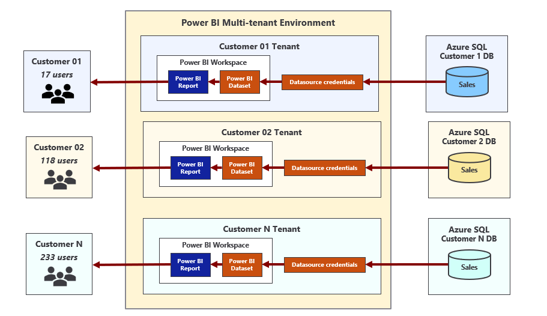

When developing an application that implements App-Owns-Data embedding,
it’s possible to call the Power BI REST API under the identity of a
master user account or under the identity of a service principal.
However, Microsoft strongly recommends using a service principal. By
using a service principal, you can avoid common problems associated with
master user accounts such as experiencing authentication errors in
environments where users are required to log in using multi-factor
authentication (MFA). Using a service principal is also consistent with
the idea that App-Owns-Data embedding is based on leverages under a
Platform as a Service (PaaS) mindset as opposed to a Software as a
Service (SaaS) mindset.

### Understanding the 1000 Workspace Limitation

When designing a multitenant environment for App-Owns-Data embedding,
there is a documented limitation that requires your attention. In
particular, the limitation is that neither a user nor a service
principal can be member of more than 1000 workspaces. The purpose of
this limitation has to do with performance. The limitation exists to
ensure code paths don't become inefficient resulting in performance
degradation. At little background might make it easier for you to
understand what's involved.

Behind the scenes, the Power BI Service maintains a set of
security-related metadata for each service principal. The Power BI
Service uses this metadata to track which workspaces and artifacts the
service principal can access. In effect, the Power BI Service maintains
a separate access control list (ACL) for each service principal as part
of its authorization subsystem.

When a service principal calls the Power BI REST API to access a
workspace, the Power BI service runs an security check against the
service principal's ACL to ensure it has the proper authorization. As
you can imagine, the time it takes to determine whether the target
workspace ID is inside the ACL increases as the number of workspaces
increases. The Power BI team created and documented the 1000-workspace
limitation to ensure the authorization metadata (i.e. ACL) for a service
principal (or user) doesn't grow so large that it significantly degrades
performance.

The 1000-workspace limitation isn’t enforced through code in the Power
BI Service. If you try, you'll find you can create 1,200 workspaces
using a single service principal. When you cross over the line from 1000
to 1001 workspaces, nothing really changes. Calls from the service
principal to the Power BI REST API will still execute successfully.
However, it's important to acknowledge that the application has moved
into an "unsupported" state which has implications when trying to get
help from Microsoft support.

To summarize, the scenario in which a service principal owns 1000
workspaces or less is supported. The scenario in which a service
principal owns 1001 workspaces or more is unsupported. Let's look at a
simple example to make an additional point.

Consider a scenario in which two multi-tenant applications have each
been implemented to use a single service principal. Now imagine the
first application has created 990 workspaces while the second
application has created 1010 workspaces. From a supportability
standpoint, the first application is within the supported boundaries
while the second application is not.

Now let's compare these two applications purely from a performance point
of view. There's really not that much difference because the ACLs for
both service principals have let the metadata for their ACLs grow to a
point where it will degrade performance to some degree.

Here's the key observation. The number of workspaces created by a
service principal has a direct effect on performance. A service
principal which is a member of 100 workspaces will execute calls on the
Power BI REST API faster than a service principal which is a member of
1000 workspaces. Likewise, a service principal which is a member of only
10 workspaces will execute calls faster than a service principal which
is a member of 100 workspaces. From the perspective of performance and
scalability, the optimal number of workspaces in which a service
principal should be a member is 1.

### Managing Isolation for Datasets and Datasource Credentials

Another important aspect of designing an App-Owns-Data embedding
application for a multitenant environment has to do with maintaining the
required level of isolation across customer tenants. The last thing you
want is for a user in one customer tenant to see data from another
tenant that belongs to a different customer. Therefore, it's critical
that you understand how datasets and datasource credentials are managed
within the Power BI Service.

Each dataset in the Power BI Service has an owner which can be either a
user or a service principal. You can discover who the dataset owner is
by inspecting the **ConfiguredBy** property in the dataset settings
page. You can perform a Take Over action to transfer dataset ownership
from one user or service principal to another. If you import a PBIX file
to create a new dataset using a service principal, the service principal
is automatically configured as the dataset owner.

In order to connect a dataset to its underlying datasource, the dataset
owner must set dataset credentials. These datasource credentials are
then cached by the Power BI Service in an encrypted fashion. After that
point, the Power BI Service is then able to use those credentials to
authenticate with the underlying datasource when refreshing the data in
an import-mode dataset or when executing a query with a DirectQuery
dataset.

There is a common pattern used by developers when provisioning a new
customer tenant where the application executes a series of calls all
running as a service principal. The first call creates a new workspace.
The second call associates that workspace with a dedicated capacity.
Next, there is a call to import a PBIX file to create a new dataset.
After importing a PBIX file to create a dataset, a service principal can
then set the dataset source credentials for that dataset. As a result of
these Power BI REST API calls, the service principal is an Admin of the
new workspace and the owner of the dataset and the datasource
credentials.

A common misconception is that datasource credentials in the Power BI
Service are scoped at the workspace level. They are not. Instead,
datasource credentials are scoped by user or by service principal and
their scope extends across all Power BI workspaces in the current Azure
AD tenant. It's possible for a service principal to create datasource
credentials that are used by datasets in different workspaces as shown
in the following diagram.

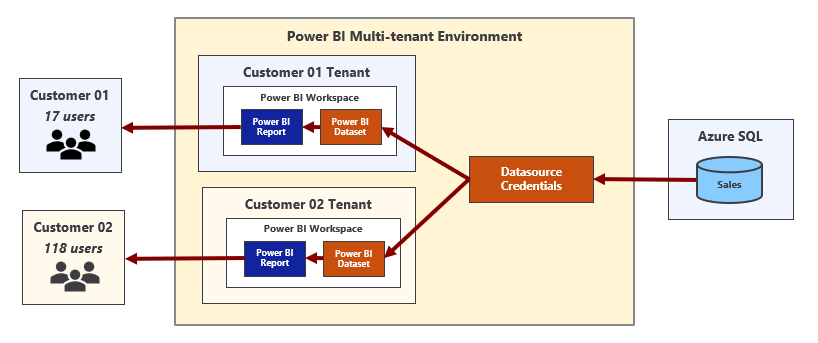

### Design Strategies Before Service Principal Profiles

In this section, we will quickly review the three common design
strategies that have been used to build and manage multitenant
environments for App-Owns-Data embedding. This give you a better
appreciation of the design problems that service principal profiles
feature was designed to solve.

Prior to the introduction of service principal profiles, developers have
built multitenant applications with support for App-Owns-Data embedding
using one the following three design strategies.

-   Single service principal

-   Service principal pooling

-   One service principal per workspace

Now let's review the strengths and weakness of each of these design
strategies starting with single service principal. When an application
is designed to use a single service principal, it requires a one-time
creation of Azure AD application for service principal. Therefore, it
requires less administrative overhead than the other two strategies
because there is no ongoing need to create new Azure AD applications in
order to add more service principals. It is also the easiest strategy to
implement as the other two strategies require extra code to switch the
calling context between service principals when calling the Power BI
REST API.

The obvious problem with the single service principal design strategy is
it doesn't scale. It only supports a multitenant environment that can
grow to no larger than 1000 workspaces. The application will also be
less performant as the service principal becomes a member of a large
number of workspaces. Finally, there is a problem with customer tenant
isolation because there is a single service principal that will be the
owner of every dataset and all data credentials across all customer
tenants.

Service principal pooling provides a commonly-used strategy to get
around the 1000-workspace limitation. The main idea is that the
application can scale to any number of required workspaces by adding the
correct number of service principals to the pool. For example, a pool of
5 service principals makes it possible to scale up to 5,000 workspaces.
A pool of 80 service principals makes it possible to scale up to 80,000
workspaces.

While service principal pooling can scale to a large number of
workspaces, it has several disadvantages. First, it requires extra code
and metadata to implement context switching between service principals
when calling the Power BI REST API. Second, there is more administrative
overhead as it will be necessary to create new Azure AD applications
whenever it's necessary to increase the number of the service principals
in the pool.

The service principal pooling strategy is not optimized for performance
because it allows service principals to become members of 100s of
workspaces. It also is not ideal from the perspective of customer tenant
isolation. While it's slightly better than the single service principal
strategy, there is still the issue where each service principal will the
the owner of datasets and datasource credentials across many different
customer tenants.

The final strategy is the one that involves creating a new service
principal for each new customer tenant. From a theoretical standpoint,
this is the best solution because it optimizes the performance of calls
to the Power BI REST API while also providing true isolation for
datasets and datasource credentials at the workspace level. However,
what works best in theory doesn't always work best in practice. This is
a good example.

The strategy of creating a new service principal for each new customer
tenant is impractical for most large organizations. That's because these
organizations require formal approval processes or they introduce other
bureaucratic red tape for creating new Azure AD applications. This makes
it impossible to grant a custom application the authority it needs to
create new Azure AD applications on-demand in an automated fashion which
is a requirement when using this strategy.

In less common scenarios where a custom application is granted the
proper permissions, it can use the Microsoft Graph API to create new
Azure AD applications on demand. This type of custom application becomes
more complex to develop and deploy because it must somehow track
credentials for each Azure AD application and gain access to those
credentials whenever it needs to authenticate and acquire access tokens
for individual service principals. The
[TenantManagement](https://github.com/PowerBiDevCamp/TenantManagement)
sample application demonstrates using this approach.

## Introduction to Service Principal Profiles

The previous section discussed three essential problems that need to be
addressed when developing a multitenant application that uses
App-Owns-Data embedding. Here is a summary of those three problems.

1.  Scaling to a large number of workspaces

2.  Optimizing performance in calls to the Power BI REST API

3.  Isolating datasets and datasource credentials at the customer tenant
    level.

The Power BI embedding team created the service principal profiles
feature to solve these three problems with the lowest amount of
developer effort and overhead. As you will see, designing a multitenant
application using service principal profiles will combine the strengths
of the three design strategies discussed in the previous section while
avoiding the weaknesses. Now it's time to drill down into a discussion
about how service principal profiles work.

Service principal profiles are local accounts which are created within
the context of the Power BI Service. A service principal can use the new
[Profiles](https://docs.microsoft.com/en-us/rest/api/power-bi/profiles)
endpoint of the Power BI REST API to create new service principal
profiles. This makes it possible for a service principal to create and
managed its own set of service principal profiles for a custom
application as shown in the following diagram.

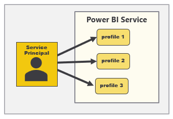

Later in this article, you will learn how to write code to create
service principal profiles as well as how to execute Power BI REST API
calls under the identity of a service principal profile. However, it's
now time to make a general observation. While the service principal
itself and its underlying Azure AD application are known to Azure AD,
Azure AD doesn't know anything about service principal profiles.
Instead, service principal profiles are created by the Power BI Service
and they only exist within the context Power BI Service subsystem which
controls security and authorization.

There will always be a parent-child relationship between a service
principal and the service principal profiles it creates. A service
principal profile can never be created as a stand-alone entity. Instead,
each service principal profile must be created by specific service
principal and that service principal will serve as the profile's parent.
Furthermore, a service principal is never visible to users or other
service principals. A service principal profile can only be seen and
used by the service principal that created it.

### Service Principal Profiles are Power BI Security Principals

The second important observation is that a service principal profile is
first-class security principal in the Power BI authorization system. The
Power BI Service treats a service principal profile like a user or a
service principal in the sense that a profile can be added to a
workspace as a member. A service principal profiles can also be the
owner of a dataset and the owner of datasource credentials. This leads
to the best practice of creating a new service principal profile for
each new customer tenant as shown in the following diagram.

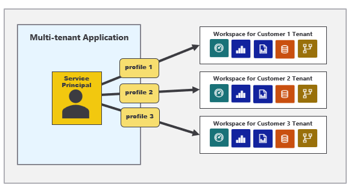

When you develop a custom application using service principal profiles,
you only need a single Azure AD application which provides your
application with a single service principal. This lowers administrative
overhead compared to previous strategies because there is no ongoing
need to create additional Azure AD applications after the application
goes into production.

### Executing Power BI REST API Calls as a Service Principal Profile

There is one more essential concept to understand when developing a
multitenant application with service principal profiles. More
specifically, you can execute Power BI REST API calls under the identity
of a service principal profile. That means you can execute the sequence
of API calls under the identity of a service principal profile when
provisioning a new customer tenant. Let's examine this in a little more
detail.

If you execute a Power BI REST API call under the identity of a service
principal profile to create a new workspace, that profile will
automatically be configured as a workspace member in the role of Admin.
If you execute a call under the identity of a service principal profile
to import a PBIX file and create a dataset, that profile will be
configured as the dataset owner. If you execute call under the identity
of a service principal profile to set datasource credentials, the
profile will be configured as the owner of the datasource credentials.

Programming with service principal profiles might seem a little
complicated at first. You can execute API calls under the identity of a
service principal profile and you can also execute a call without a
profile which will execute under the identity of the service principal.
It's important to understand that a service principal has an identity in
the Power BI Service that is separate and distinct from the identities
of its profiles.

Now it's time to focus on how to program when developing a multitenant
application using service principal profiles. When do you execute Power
BI REST API calls as the parent service principal versus when do you
execute API calls a child service principal profile? It turns out this
isn’t too complicated once you understand the basic pattern.

You should execute API calls as the service principal when you are
creating, viewing and deleting service principal profiles. However, most
of the other API calls should be executed as a service principal
profile. This includes API calls to create workspaces and import PBIX
files. It also includes API calls to update dataset parameters and to
set datasource credentials. Finally, it includes API calls to query for
workspace artifacts and to generate embed tokens.

Let's look at a basic example. Imagine you need to create a new customer
tenant for a customer named Wingtip. The first step is to execute an API
call to create a new service principal profile with a display name of
Wingtip. That first call is made under the identity of the service
principal. However, all the remaining Power BI REST API calls shown in
the following list should be made under the identity of the service
principal profile that has just been created.

-   Create workspace

-   Associated workspace with capacity

-   Import PBIX

-   Update dataset parameters

-   Set credentials

-   Start refresh

It's now time to make final observation. Each customer tenant is built
using a Power BI workspace and a set of artifacts that are all owned and
managed by one specific service principal profile. In order to access
that Power BI workspace and its content at a later time, you must
execute API calls using the identity of the same service principal
profile that was used to create the customer tenant.

And what about the service principal itself? Does the service principal
require any access to the workspaces for customer tenants and the
content inside? The answer is no, the service principal itself doesn't
need any access at all. Remember, Power BI REST API calls executed under
the identity of the service principal are mainly to create and manage
service principal profiles. All workspace creation and content access is
done using service principal profiles.

### Using the Profiles API to create and manage service principal profiles

The Power BI embedding team has introduced a new **Profiles** API which
is used to create and manage service principal profiles. You can find
the documentation to the **Profiles** API at the following URL.

**https://docs.microsoft.com/en-us/rest/api/power-bi/profiles**

The Profiles API contains the following operations.

-   Create Profile

-   Delete Profile

-   Get Profile

-   Get Profiles

-   Update Profile

Let's begin by looking at the Create Profile operation. The following
table shows the details required for executing an HTTP POST request
against the **Profiles** endpoint to create a new service principal
profile.

Note that you must pass a **displayName** property in the request body
to provide a display name for the new tenant. The **displayName** must
be unique across all the profiles owned by a specific service principal.

The API call to create a new service principal profile returns which a
GUID in the **id** property which represents the profile id. In an
application that uses service principal profiles, it's a best practice
to display profile names and ids in a custom database so the application
can lookup the id for a service principal profile when that's required.

If you are programming with the Power BI .NET SDK, you can call
**Profile.CreateProfile** using the following code.

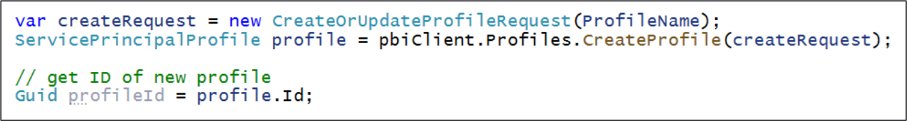

When you need to delete a service principal profile, you can execute an
HTTP DELETE operation in which the profile id is parsed into the end of
the URL.

If you are programming with the Power BI .NET SDK, you can call
**Profile.DeleteProfile** using the following code.

Ss

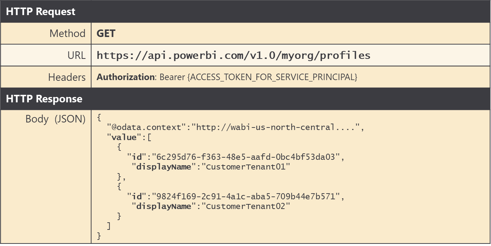

C

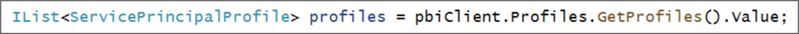

X

X

Xx

X

Calling

Xxxx pass header

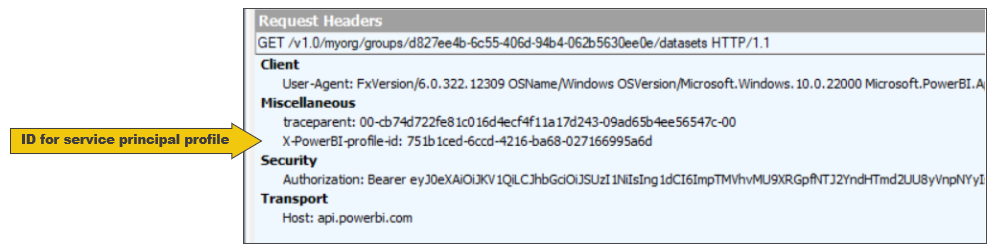

x

## Getting Started with the **AppOwnsDataMultiTenant** application

The **AppOwnsDataMultiTenant** application demonstrates how to manage a
multitenant environment for Power BI embedding using service principal
profiles. This sample application has been designed to use the best
practice of creating a separate service principal profile for each new
customer tenant. This design strategy optimizes calls to the Power BI
REST API while also providing dataset and datasource credential
isolation at the customer tenant level. The design of the
**AppOwnsDataMultiTenant** application also makes it possible to scale
upwards to manage an environment with up to and beyond 100,000 customer
tenants.

the **AppOwnsDataMultiTenant** application provides a screen

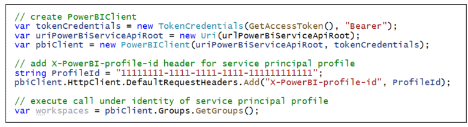

When you click the **Create New Tenant** button, the application
executes code which begins by creating a new service principal profile
using the same name as the **Tenant Name**. After creating the service
principal profile, the application then switches contexts and begins
calling the Power BI REST API using that profile's identity to provision
customer tenants. This application design maintains a one-to-one
relationship between service principal profiles and customer tenant
workspaces which is what Microsoft recommends as a best practice.

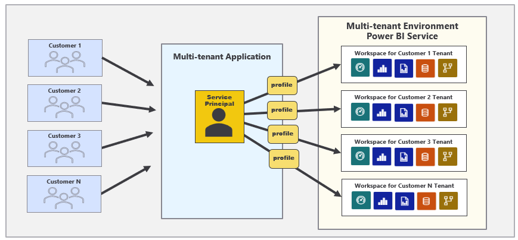

The **AppOwnsDataMultiTenant** application demonstrates code which
authenticates with Azure AD to acquire access tokens used to call the
Power BI REST API as a service principal or as a service principal
profile. However, this application was designed as a proof-of-concept
(POC) and, consequently, it does not provide any logic to authenticate
or authorize the user authentication. If you are going to use the
**AppOwnsDataMultiTenant** application as a starting point for something
building, it will be your responsibility to add in the code required to
authenticate and authorize users who will be responsible for creating
and managing customer tenants.

### Setting up your development environment

You can follow the steps in this section to set up
the **AppOwnsDataMultiTenant** application for testing. To complete
these steps, you will require a Microsoft 365 tenant in which you have
permissions to create and manage Azure AD applications and security
groups. You will also need Power BI Service administrator permissions to
configure Power BI settings to give service principals to ability to
access the Power BI Service API. If you do not have a Microsoft 365
environment for testing, you can create one for free by following the
steps in [Create a Development Environment for Power BI
Embedding](https://github.com/PowerBiDevCamp/Camp-Sessions/raw/master/Create%20Power%20BI%20Development%20Environment.pdf).

To set up the **AppOwnsDataMultiTenant** application for testing, you
will need to configure a Microsoft 365 environment by completing the
following tasks.

1.  Create an Azure AD security group named **Power BI Apps**

2.  Configure Power BI tenant-level settings for service principal
    access

3.  Configure Power BI tenant-level settings to enable service principal
    profiles

4.  Create the Azure AD Application for
    the **AppOwnsDataMultiTenant** Application

The following three sections will step through each of these setup
tasks.

### Create an Azure AD security group named Power BI Apps

Begin by navigating to the [Groups management
page](https://portal.azure.com/#blade/Microsoft_AAD_IAM/GroupsManagementMenuBlade/AllGroups) in
the Azure portal. Once you get to the **Groups** page in the Azure
portal, click the **New group** link.

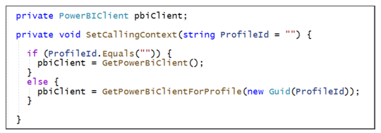

In the **New Group** dialog, Select a **Group type** of **Security** and
enter a **Group name** of **Power BI Apps**. Click the **Create** button
to create the new Azure AD security group.

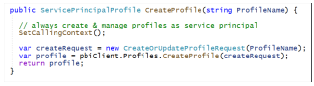

Verify that you can see the new security group named **Power BI
Apps** on the Azure portal **Groups** page.

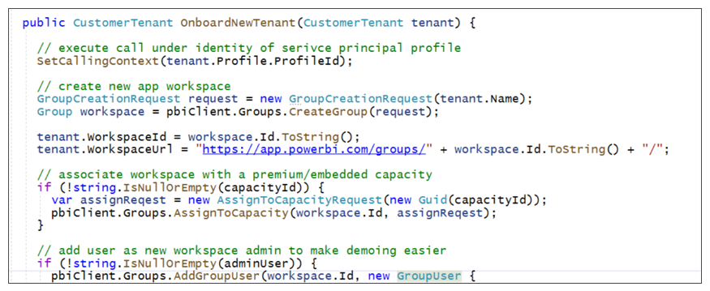

### Configure Power BI tenant-level settings for service principal access

Next, you need you enable a tenant-level setting for Power BI
named **Allow service principals to use Power BI APIs**. Navigate to the
Power BI Service admin portal at <https://app.powerbi.com/admin-portal>.
In the Power BI Admin portal, click the **Tenant settings** link on the
left.

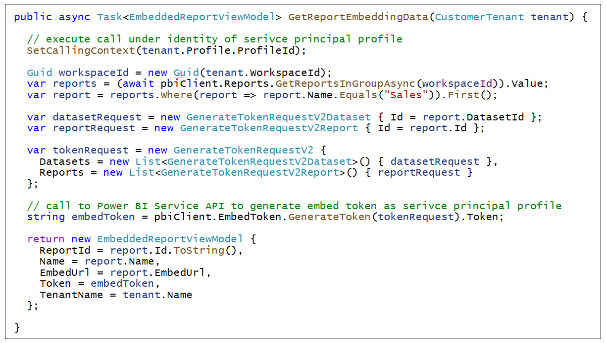

Move down in the **Developer settings** section and expand the **Allow
service principals to use Power BI APIs** section.

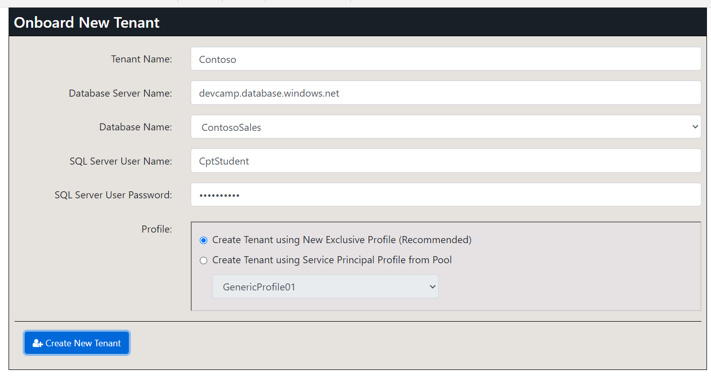

Note that the **Allow service principals to use Power BI APIs** setting
is initially set to **Disabled**.

Change the setting to **Enabled**. After that, set the **Apply
to** setting to **Specific security groups** and add the **Power BI
Apps** security group as shown in the screenshot below. Click
the **Apply** button to save your configuration changes.

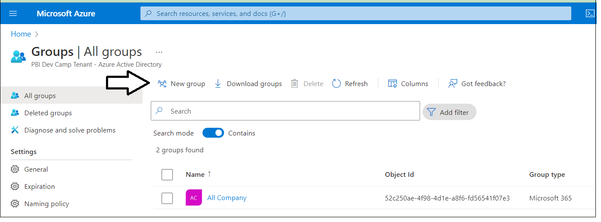

You will see a notification indicating it might take up to 15 minutes to
apply these changes to the organization.

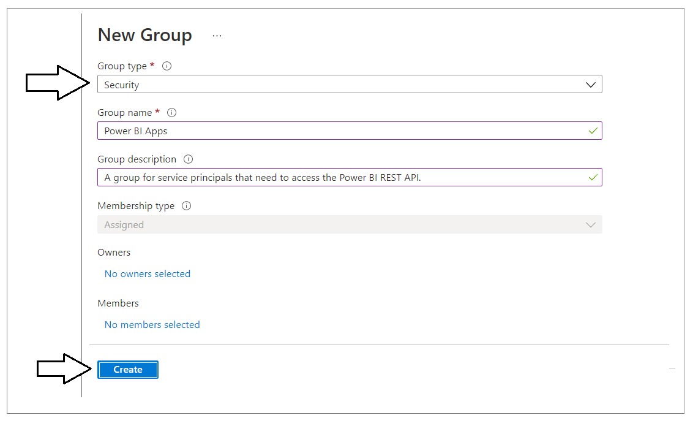

Now look down in the **Tenant setting** section of the Power BI admin
portal and locate **Workspace settings**

Xxxx

Now scroll upward in the **Tenant setting** section of the Power BI
admin portal and locate **Workspace settings**.

Note that a new Power BI tenant has an older policy where only users who
have the permissions to create Office 365 groups can create new Power BI
workspaces. You must reconfigure this setting so that service principals
in the **Power BI Apps** group will be able to create new workspaces.

In **Workspace settings**, set **Apply to** to **The entire
organization** and click the **Apply** button to save your changes.

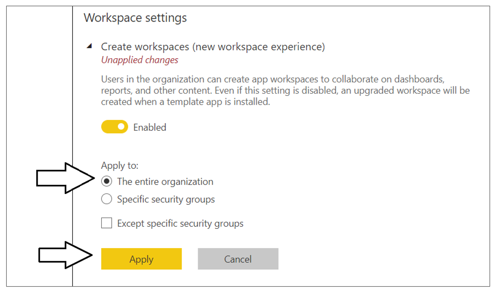

You have now completed the configuration of Power BI tenant-level
settings.

### Create the Azure AD Application for the **AppOwnsDataMultiTenant** Application

Login to the Azure portal to create the new Azure AD application. Begin
by navigating to the [App
registration](https://portal.azure.com/#blade/Microsoft_AAD_IAM/ActiveDirectoryMenuBlade/RegisteredApps) page
in the Azure portal and click the **New registration** link.

On the **Register an application** page, enter an application name such
as **Power BI Embedding Tenant Manager** and accept the default
selection for **Supported account types** of **Accounts in this
organizational directory only**.

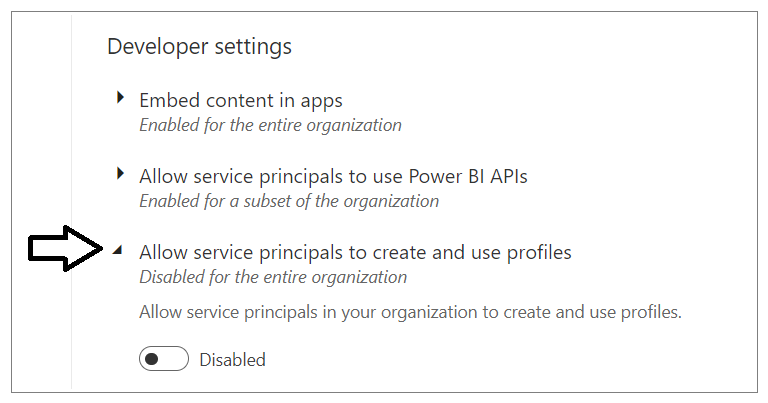

Complete the following steps in the **Redirect URI** section.

1.  Set the dropdown selection of **Web** in the dropdown box

2.  Do not enter a value for the **Redirect URI**. Leave it blank.

3.  Click the **Register** button to create the new Azure AD
    application.

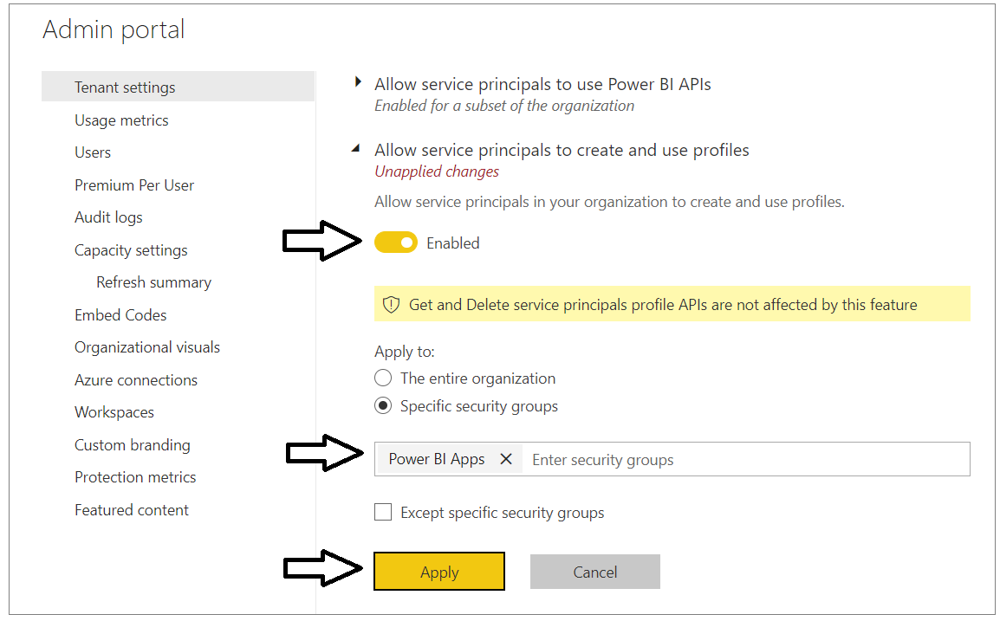

After creating a new Azure AD application in the Azure portal, you
should see the Azure AD application overview page which displays
the **Application ID**. Note that the ***Application ID*** is often
called the ***Client ID***, so don't let this confuse you. You will need
to copy this Application ID and store it so you can use it later to
configure the project's support for Client Credentials Flow.

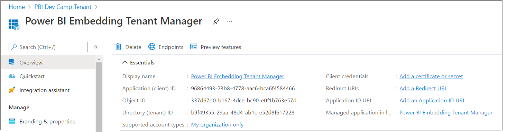

Copy the **Tenant ID** (aka Directory ID) and paste it into a text
document so you can use it later in the setup process. Note that
this **Tenant ID** value will be used
by **AppOwnsDataMultiTenant** project to configure authentication with
Azure AD.

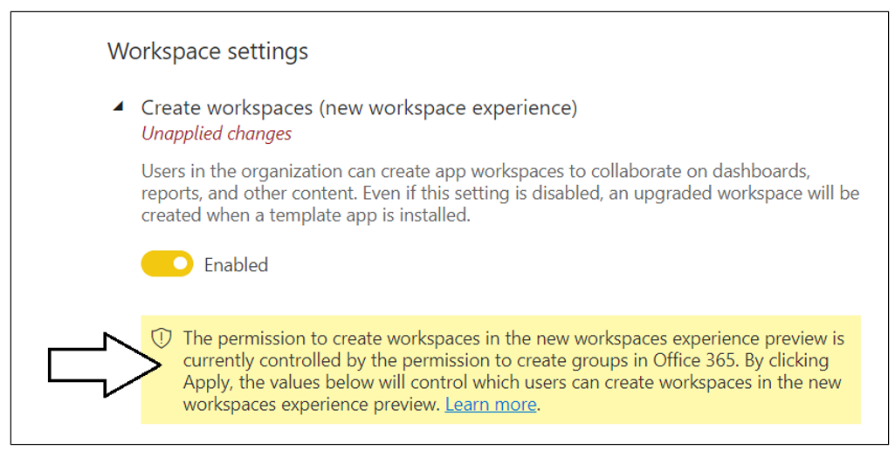

Next, repeat the same step by copying the **Client ID** and copying that
into the text document as well.

Your text document should now contain the  **Tenant ID** and **Client
ID**  as shown in the following screenshot.

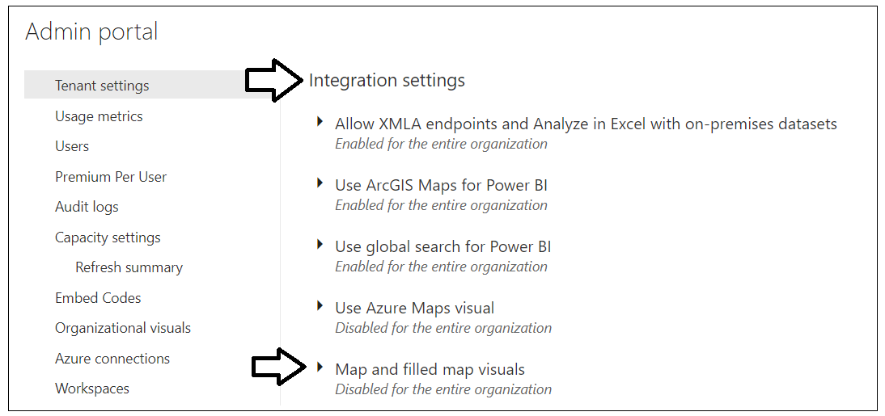

Next, you need to create a Client Secret for the application. Click on
the **Certificates & secrets** link in the left navigation to move to
the **Certificates & secrets** page. On the **Certificates &
secrets** page, click the **New client secret** button as shown in the
following screenshot.

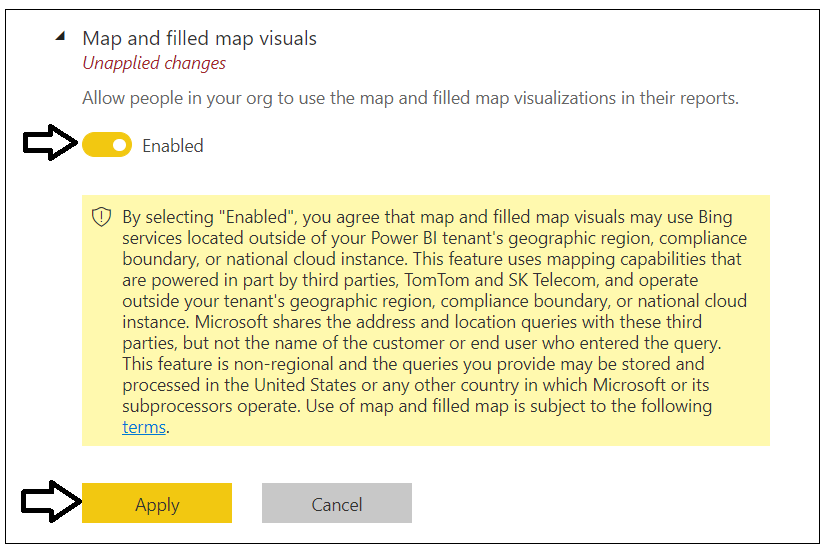

In the **Add a client secret** dialog, add a text description such
as **Test Secret** and then click the **Add** button to create the new
Client Secret.

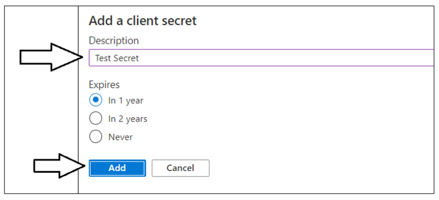

Once you have created the Client Secret, you should be able to see
its **Value** in the **Client secrets** section. Click on the **Copy to
clipboard** button to copy the Client Secret into the clipboard.

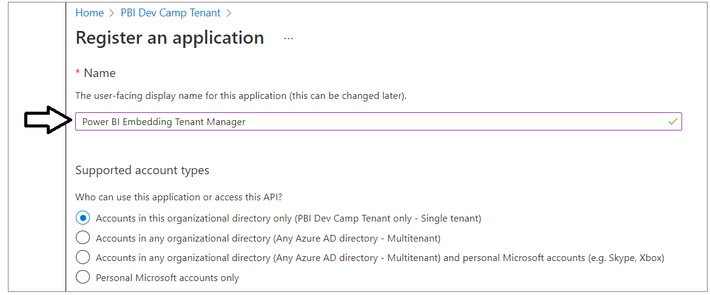

Paste the **Client Secret** into the same text document with
the **Client ID** and **Tenant ID**.

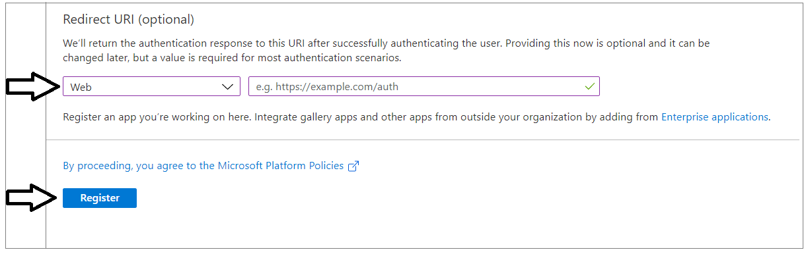

Xxxx

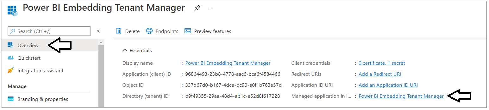

Xxxxxxxxx

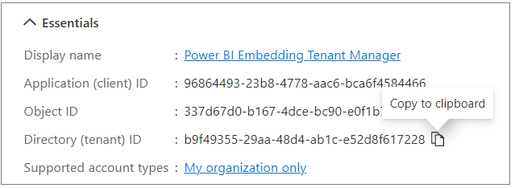

Xxxxx

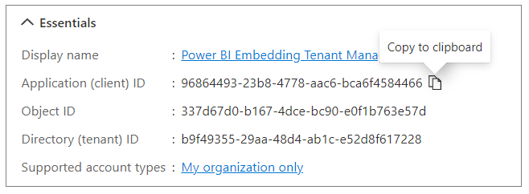

## Test the Tenant Management project in Visual Studio 2022

In order to run and test the **AppOwnsDataMultiTenant** project on a
developer workstation, you must install the .NET 6 SDK and/or Visual
Studio 2022. While this document will walk through the steps of opening
and running the **AppOwnsDataMultiTenant** project using Visual Studio
2022, you can also open and run the project using Visual Studio Code if
you prefer that IDE. Here are links to download this software if you
need them.

1.  .NET 6 SDK – \[**download**\]

2.  Visual Studio 2022 – \[**download**\]

3.  Visual Studio Code – \[**download**\]

### Download the Source Code

The source code for the **AppOwnsDataMultiTenant** project is maintained
in a GitHub repository at the following URL.

[**https://github.com/PowerBiDevCamp/AppOwnsDataMultiTenant**](https://github.com/PowerBiDevCamp/TenantManagement)

You can download the **AppOwnsDataMultiTenant** project source files in
a single ZIP archive using [this
link](https://github.com/PowerBiDevCamp/AppOwnsDataMultiTenant/archive/refs/heads/main.zip).
If you are familiar with the **git** utility, you can clone the project
source files to your local developer workstation using the
following **git** command.

git clone https://github.com/PowerBiDevCamp/AppOwnsDataMultiTenant.git

Once you have downloaded the source files for
the **AppOwnsDataMultiTenant** repository to your developer workstation,
you will see there is a top-level project folder
named **AppOwnsDataMultiTenant** which contains several files including
a solution file named **AppOwnsDataMultiTenant.sln** and a project file
named **AppOwnsDataMultiTenant.csproj**.

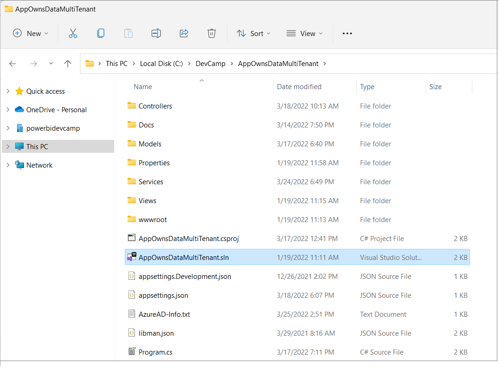

### Open the Project in Visual Studio 2022

Launch Visual Studio 2019 and use the **File \> Open \>
Project/Solution** menu command to open the solution file
named **AppOwnsDataMultiTenant.sln**. You should note that this
development project has been built as a .NET 6 MVC Web Application as
shown in the following screenshot.

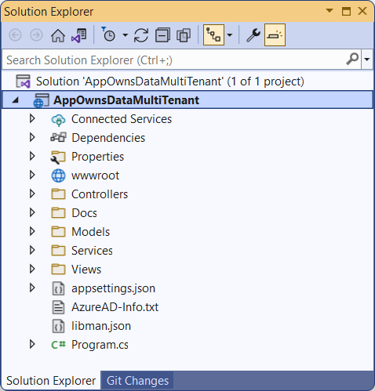

Let's quickly review the NuGet packages that have been installed in
the **AppOwnsDataMultiTenant** project. There are several NuGet packages
which add Entity Framework support which make it possible to quickly
create the SQL Server database associated with this project.

There are several packages included to add Azure AD authentication
support including **Microsoft.Identity.Web** . The package
named **Microsoft.PowerBI.Api** has been included to support .NET
programming with the Power BI REST API.

### Update application settings in the appsettings.json file

Before you can run the application in the Visual Studio debugger, you
must update several critical application settings in
the **appsettings.json** file. Open the **appsettings.json** file and
examine the JSON content inside. There is three important sections
named **AzureAd**, **AppOwnsDataMultiTenantDB** and **DemoSettings**.

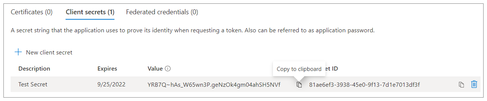

Inside the **AzureAd** section, update
the **TenantId**, **ClientId** and **ClientSecret** with the data you
collected when creating the Azure AD application named **Power BI Tenant
Management Application.**

If you are using Visual Studio 2019, you shoukd be able leave the
database connection string the way it is with the **Server** setting
of **(localdb)\\\\MSSQLLocalDB**. You can change this connection string
to point to a different server if you'd rather create the project
database named **AppOwnsDataMultiTenantDB** in a different location.

In the **DemoSettings** section there is a property named **AdminUser**.
The reason that this property exists has to with you being able to see
Power BI workspaces as they are created by service principals. There is
code in the **AppOwnsDataMultiTenant** application that will add the
user specified by the **AdminUser** setting as a workspace admin any
times it creates a new Power BI workspace. This just makes things much
easier for you to see what's going on when you begin to run and test the
application.

Update the **AdminUser** setting with your Azure AD account name so that
you will be able to see all the Power BI workspaces created by this
application.

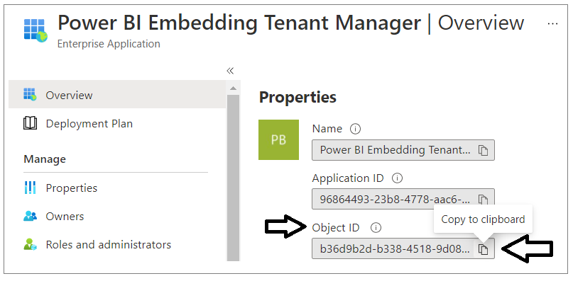

### Create the **AppOwnsDataMultiTenantDB** database

Before you can run the application in Visual Studio, you must create the
project database named **AppOwnsDataMultiTenantDB**. This database
schema has been created using the .NET 5 version of the Entity
Framework. In this step, you will execute two PowerShell cmdlets
provided by Entity Framework to create the database.

Before creating the **AppOwnsDataMultiTenantDB** database, take a moment
to understand how it’s been structured. Start by opening the file
named **AppOwnsDataMultiTenantDB.cs** in the **Models** folder. Note
that you shouldn't make any change to **AppOwnsDataMultiTenantDB.cs**.
You are just going to inspect the file you understand how
the **AppOwnsDataMultiTenantDB** database is generated.

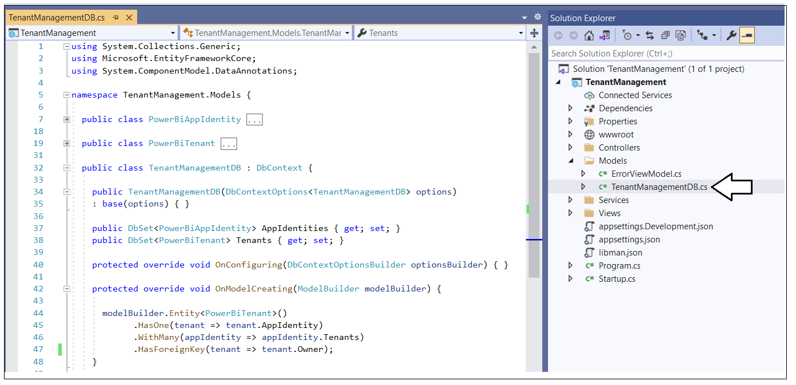

When you inspect the code inside **AppOwnsDataMultiTenantDB.cs**, you
will see a class named **AppOwnsDataMultiTenantDB** that derives
from **DbContext** to add support for automatic database generation
using Entity Framework. The **AppOwnsDataMultiTenantDB** class serves as
the top-level class for the Entity Framework which contains
two **DBSet** properties named **AppIdentites** and **Tenants**. When
you generate the database, each of these **DBSet** properties will be
created as database tables. The **AppIdentites** table is generated
using the table schema defined by the **PowerBiAppIdentity** class.

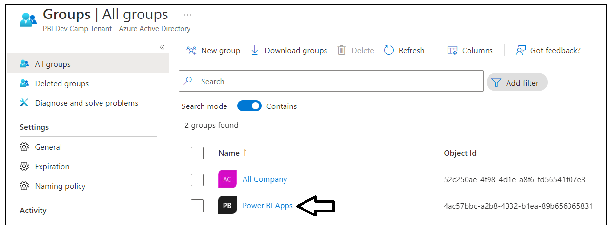

The **Tenants** table is generated using the table schema defined by
the **PowerBiTenant** class.

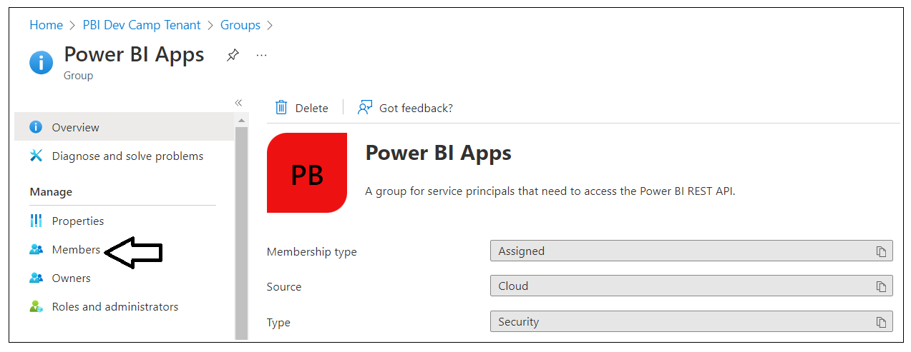

After you have inspected the code used to generated the database, close
the source file named **AppOwnsDataMultiTenantDB.cs** without saving any
changes. The next step is to run the PowerShell commands to create the
project database named **AppOwnsDataMultiTenantDB**.

Open the Package Manager console using **Tools \> NuGet Package Manager
\> Package Manager Console**.

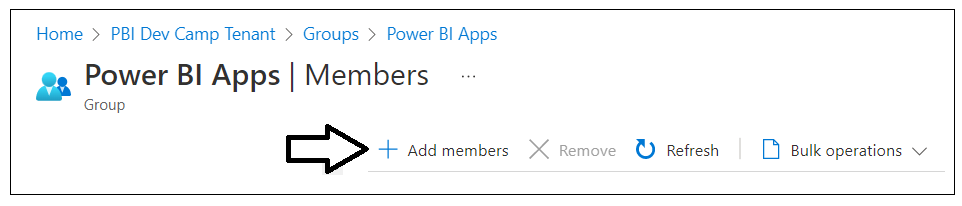

You should see the **Package Manager Console** command prompt where you
can execute PowerShell commands.

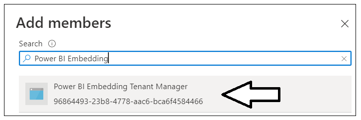

Type and execute the following **Add-Migration** command to create a new
Entity Framework migration in the project.

Add-Migration InitialCreate

The **Add-Migration** command should run without errors. If this command
fails you might have to modify the database connection string
in **appsettings.json**.

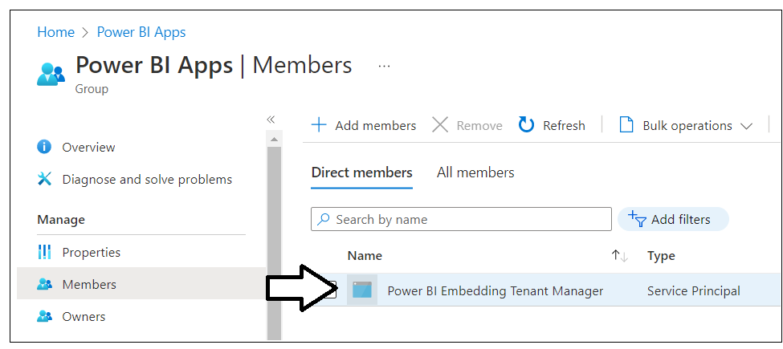

After running the Add-Migration command, you will see a new folder has
been added to the project named **Migrations** with several C# source
files. There is no need to change anything in thee source files but you
can inspect what's inside them if you are curious how the Entity
Framework does its work.

Return to the **Package Manager Console** and run the
following **Update-Database** command to generate the database
named **AppOwnsDataMultiTenantDB**.

Update-Database

The **Update-Database** command should run without errors and generate
the database named **AppOwnsDataMultiTenantDB**.

In Visual Studio, you can use the **SQL Server Object Explorer** to see
the database that has just been created. Open the **SQL Server Object
Explorer** by invoking the **View \>** **SQL Server Object
Explorer** menu command.

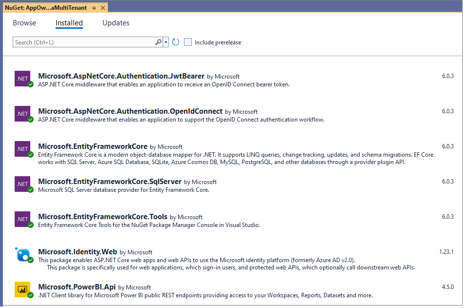

Expand the **Databases** node for the server you are using and verify
you an see the new database named **AppOwnsDataMultiTenantDB**.

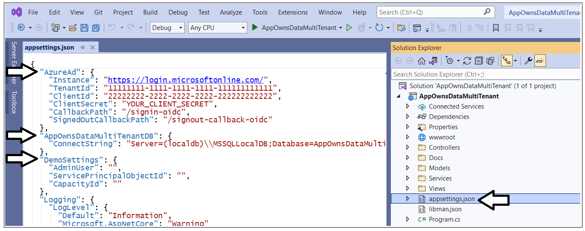

If you expand the **Tables** node for **AppOwnsDataMultiTenantDB**, you
should see the two tables named **AppIdentities** and **Tenants**.

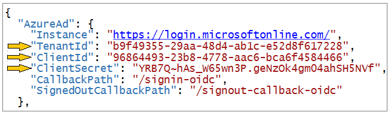

The **AppOwnsDataMultiTenantDB** database has now been set up and you
are ready to run the application in the Visual Studio debugger.

## Test the Tenant Management Application

Launch the **AppOwnsDataMultiTenant** web application in the Visual
Studio debugger by pressing the **{F5}** key or clicking the Visual
Studio **Play** button with the green arrow and the caption **IIS
Express**.

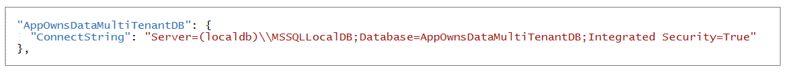

When the application starts, click the **Sign in** link in the upper
right corner to begin the user login sequence.

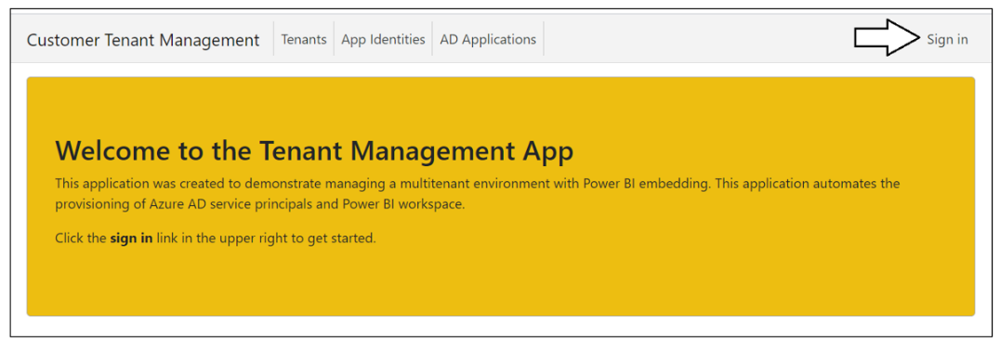

The first time you authenticate with Azure AD, you'll be prompted with
the **Permissions requested** dialog asking you to accept the delegated
permissions for the Microsoft Graph API requested by the application.
Click the **Accept** button to grant these permissions and continue.

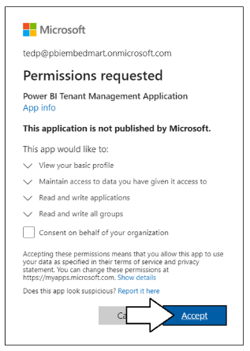

Once you have logged in, you should see your name in the welcome
message.

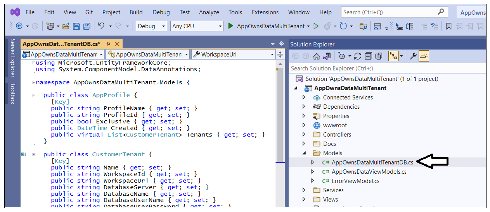

### Create App Identities

Start by creating a few new App Identities. Click the **App
Identities** link to navigate to the **App Identities** page.

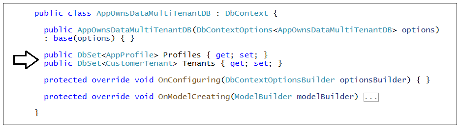

Click the **Add New App Identity to Pool** button to display
the **Create New App Identity** page.

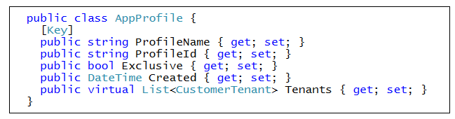

When you open the **Create New App Identity** page, it will
automatically populate the **App Identity Name** textbox with a value
of **ServicePrincipal01**. Click the **Add New App Identity to
Pool** button to create the new app identity.

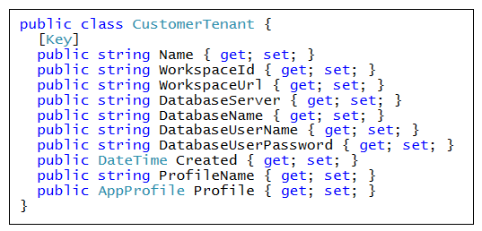

After a few second, you should see the new app identity
named **ServicePrinicpal01** on the **App Identities** page.

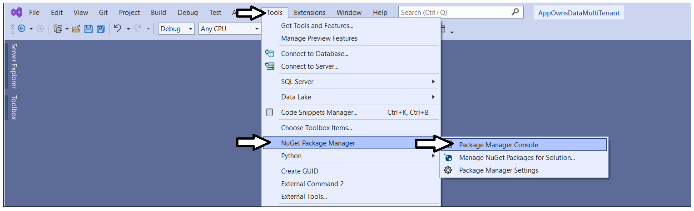

Follow the same steps to create two more app identities
named **ServicePrincipal02** and **ServicePrincipal03**. When you're
done, the **App Identities** page should match the following screenshot.

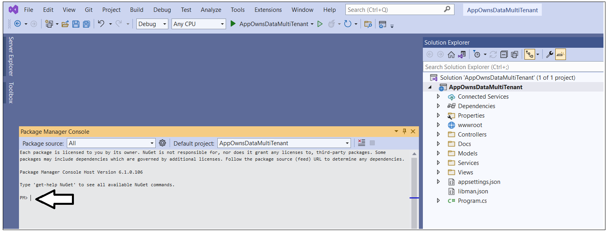

Note that behind the scenes the **AppOwnsDataMultiTenant** application
is using the Microsoft Graph API to create new Azure AD application each
time you create a new app identity. If you return pack to the [App
registration
page](https://portal.azure.com/#blade/Microsoft_AAD_IAM/ActiveDirectoryMenuBlade/RegisteredApps) in
the Azure portal, you will see that an Azure AD application has been
created for each app identity you've created.

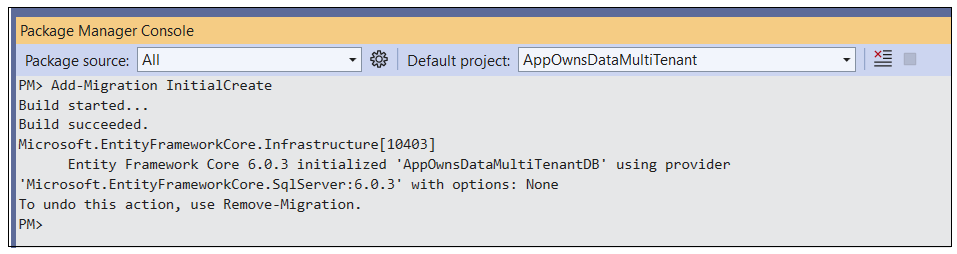

If you return to
the [Groups](https://portal.azure.com/#blade/Microsoft_AAD_IAM/GroupsManagementMenuBlade/AllGroups) page
in the Azure portal and drill into the **Members** page of the **Power
BI Apps** security group, you will see that
the **AppOwnsDataMultiTenant** application has also added the service
principal for each azure AD application as a group member. This is
important because these service principals must be added to this Azure
AD security group or they will not be able to call the Power BI REST
API.

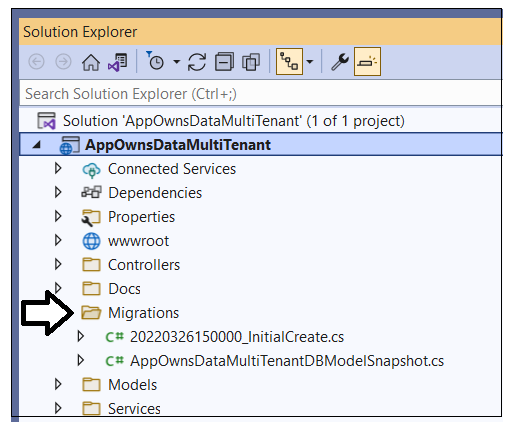

In addition to communicating with Azure AD to create and configure Azure
AD application, the **AppOwnsDataMultiTenant** application also captures
application metadata and authentication credentials so it can store them
in the **AppOwnsDataMultiTenantDB** database. Soon you will see how
the **AppOwnsDataMultiTenant** application is able to retrieve these
credentials on demand and authenticate with Azure AD under the identity
of any of these Azure AD applications.

**CAVEAT**: Keep in mind that the **AppOwnsDataMultiTenant** application
has been designed as a proof-of-concept (POC) application to teach
concepts and provide a starting point for other developers. This
application does not include certain aspects that are important to
include in a real-world applications such as hiding secrets. If you plan
to extend this POC sample application into a production application, it
will be your responsibility to add support for hiding credentials such
as the Client Secret. You can consider an approach such as using
the [Always
Encrypted](https://docs.microsoft.com/en-us/sql/relational-databases/security/encryption/always-encrypted-database-engine?view=sql-server-ver15) feature
in Azure SQL or extending the **AppOwnsDataMultiTenant** application to
store client secrets or client certificates in [Azure Key
Vault](https://docs.microsoft.com/en-us/azure/key-vault/general/basic-concepts).

### Create New Power BI Tenants

Return to the **AppOwnsDataMultiTenant** application and navigate to
the **Tenants** page.

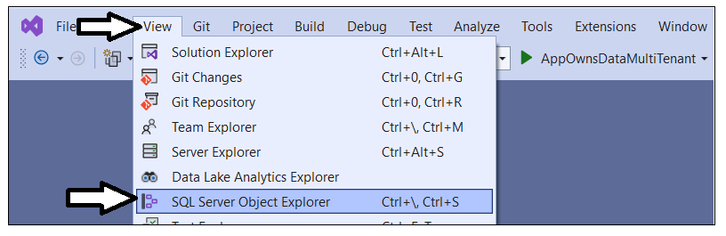

Click the **Onboard New Tenant** button to display the **Onboard New
Tenant** page.

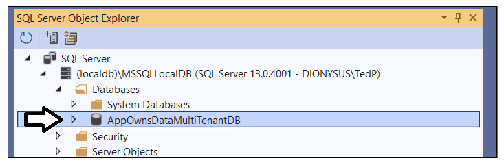

You can create the first tenant using the default values supplied by
the **Onboard New Tenant** page. Click to **Create New Tenant** button
to begin the process of creating a new customer tenant.

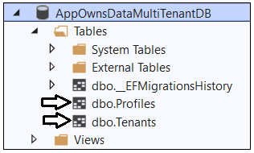

After a few seconds, you should see the new customer tenant has been
created.

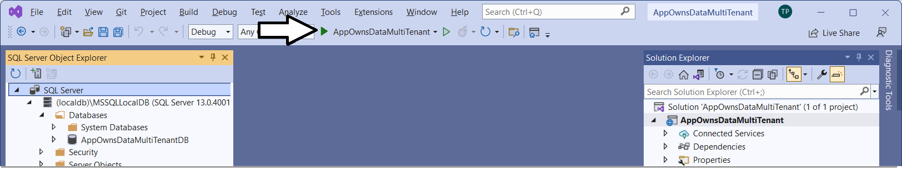

Click the **Onboard New Tenant** button again to create a second tenant.

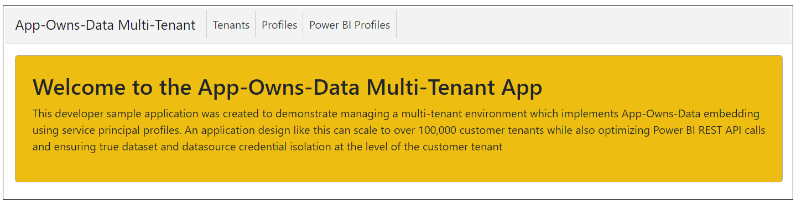

This time, select a different database for **Database Name** and then
click **Create New Tenant**.

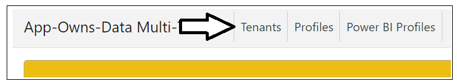

You should now have two customer tenants. Note they each tenant has a
different app identity as its **Owner**.

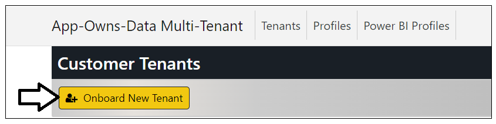

Follow the same steps to create two more customer tenants so that there
are 3 app identities and 4 customer tenants. Once you have created more
tenants then app identities, you should see app identity pooling where
multiple customer tenants share the same app identity.

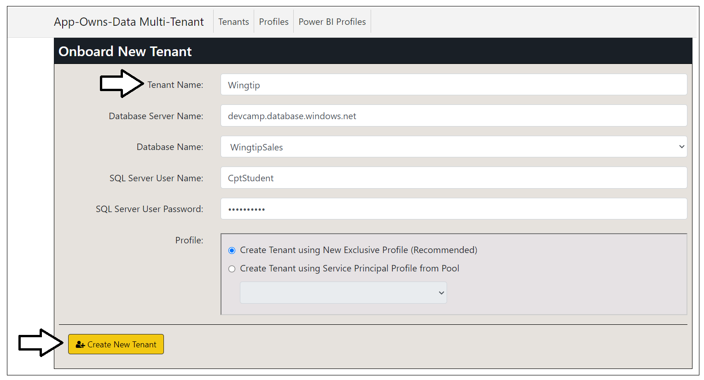

Now let's discuss what's going on behind the scenes. As you create a new
customer tenant, the **AppOwnsDataMultiTenant** application uses the
Power BI REST API to implement the following onboarding logic.

1.  Create a new Power BI workspace

2.  Upload a [template PBIX
    file](https://github.com/PowerBiDevCamp/TenantManagement/raw/main/TenantManagement/wwwroot/PBIX/DatasetTemplate.pbix) to
    create the **Sales** dataset and the **Sales** report

3.  Update dataset parameters on **Sales** dataset to point to this
    customer's database

4.  Patch credentials for the SQL datasource used by
    the **Sales** dataset

5.  Start a refresh operation on the **Sales** database

The **AppOwnsDataMultiTenant** application also create a new record in
the **Tenants** table of the **AppOwnsDataMultiTenantDB** database. Note
that the application identity associated with this customer tenant is
tracked in the **Owner** column.

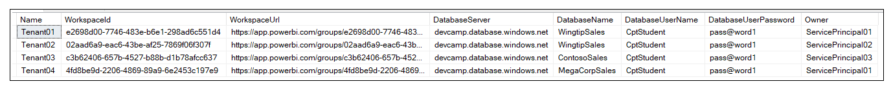

Click on the **View** button for a specific tenant on the **Power BI
Tenants** page to drill into the **Tenant Details** page.

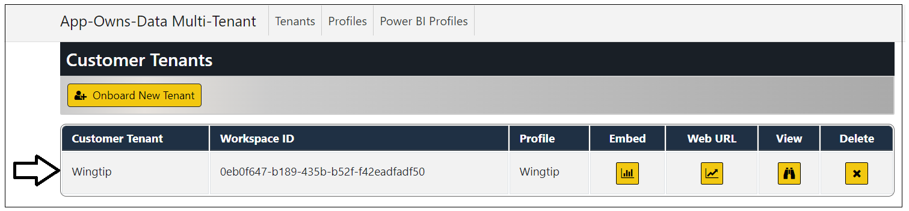

The **Tenant Details** page displays Power BI workspace details
including its members, datasets and reports.

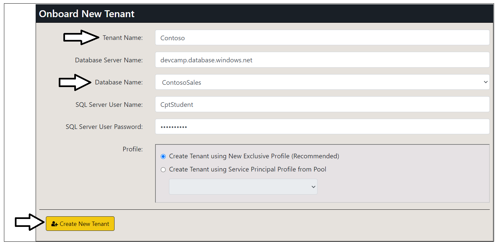

Click on the back arrow to return to the **Power BI Tenants** page.

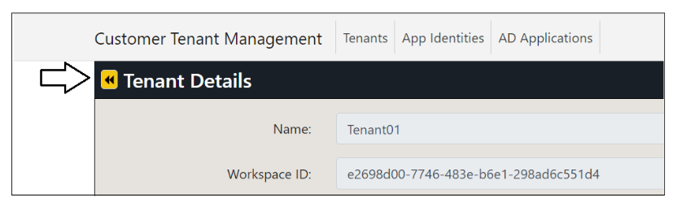

If you're interested, you can examine the details of other tenants as
well.

### Embed Reports

Now it's time to make use of
the **AppOwnsDataMultiTenant** application's ability to embed reports.
When navigate to the **Embed** page for a customer tenant,
the **AppOwnsDataMultiTenant** application must acquire an access token
for whichever app identity was used to create the customer tenant. The
service principal that is configured as the **Owner** of a tenant will
be the only service principal who will have access to access the target
workspace in Power BI.

Move to the **Power BI Tenants** page and click on the **Embed** button
for the first customer tenant.

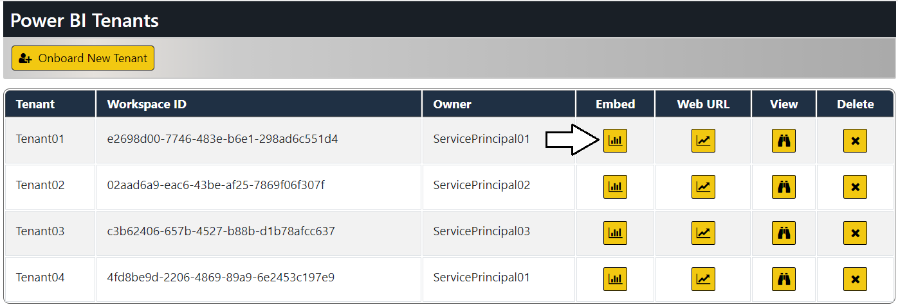

You should now see a page with an embedded report for that tenant. When
you click the **Embed** button to embed a report for a customer tenant,
the **TenanantManagement** application retrieves credentials for the app
identity associated with the tenant from
the **AppOwnsDataMultiTenantDB** database. It then uses those
credentials to acquire an access token from Azure AD using Client
Credentials Flow. That access token is then used to communicate with the
Power BI Service to retrieve report metadata and generate an embed token
for the embedding process.

Click on the back arrow button to return to the **Tenants** page.

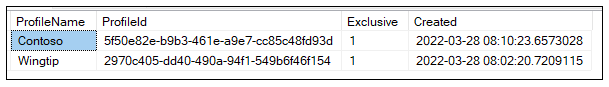

Now test clicking the **Embed** button for other customer tenants. As
you can see, the **AppOwnsDataMultiTenant** application has the ability
to acquire access tokens for any of the Azure AD applications that it
has created.

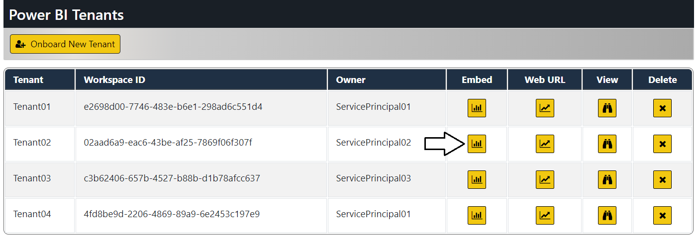

### Inspect the Power BI Workspaces

If you're curious about what's been created in Power BI, you can see for
yourself by navigating to the Power BI Service portal
at [https://app.powerbi.com](https://app.powerbi.com/). You should be
able to see and navigate to any of the Power BI workspaces that have
been created by the **AppOwnsDataMultiTenant** application.

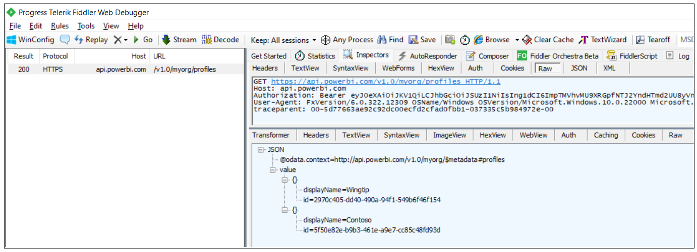

Navigate to one of these workspaces such as **Tenant01**.

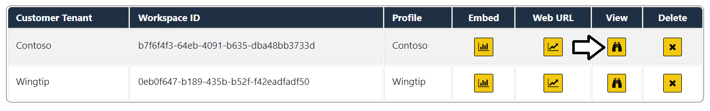

Drill into the **Setting** page for the dataset named **Sales**.

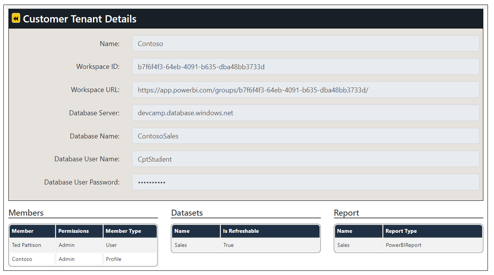

You should be able to verify that the **Sales** dataset has been
configured by one of the Azure AD applications that was created by
the **AppOwnsDataMultiTenant** application. You should also be able to
see the **Last refresh succeeded** message for the dataset refresh
operation that was started by the **AppOwnsDataMultiTenant** as part of
its tenant onboarding logic.

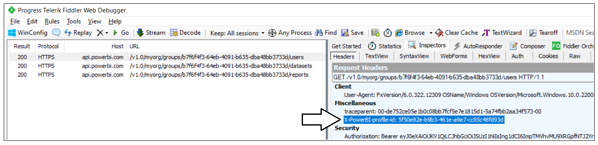

### Create a Separate Service Principal for Each Tenant

At this point you have used the **AppOwnsDataMultiTenant** application
to pool app identities where one service principal can be the owner of
multiple customer tenants. While this approach will work for many
organizations and ISVs using Power BI embedding, you can take things one
step further by creating a new service principal each time you create a
new customer tenant. An application design which maintains a one-to-one
relation between service principals and customer tenants will provide
the most secure level of isolation. When you pool a service principal
across tenants, that service principal will be the owner of datasource
credentials for more than a single client.

When creating a new customer tenant using the **Onboard New
Tenant** page, you can select the option to **Create Tenant using New
Exclusive App Identity**. If you select this option,
the **AppOwnsDataMultiTenant** application will create a new Azure AD
application and then use the service principal from that application to
create the workspace in Power BI.

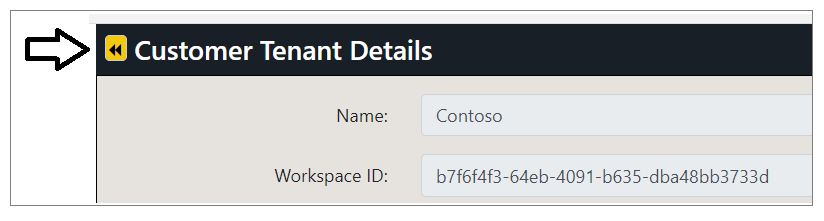

You should take note that The **AppIdentities** table in
the **AppOwnsDataMultiTenantDB** database contains a boolean column
named **Exclusive**. When an app identity has an **Exclusive** column
value of **true**, there is logic in the application which knows it
should not include that app identity in the pool of app identities
available on the **Onboard New Tenant** page.

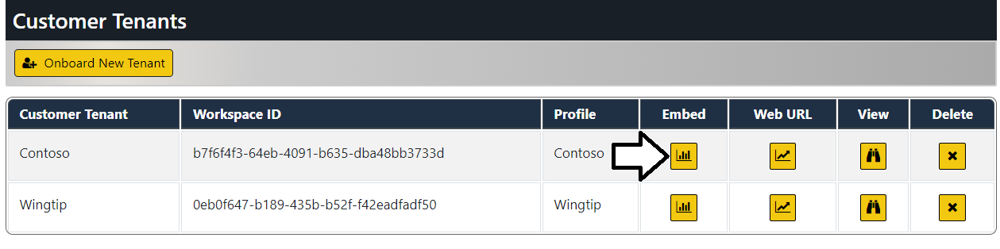

This concludes the walkthrough of
the **AppOwnsDataMultiTenant** application.
