### Summary
The **AppOwnsDataMultiTenant** application is a sample .NET 6
application which demonstrates how to design an application which
implements App-Owns-Data embedding using **service principal profiles**.
This article explains how to leverage service principal profiles to
design and implement a large-scale, multitenant environment for Power BI
embedding with 10,000's or 100,000's of customer tenants.

This article will began with a quick primer on developing multitenant
application using App-Owns-Data embedding. This primer will allow the
reader to better understand the problems that service principal profiles
were created to solve. Next, this article will introduce service
principal profiles and explain how they can be used to improve
performance, scalability and security in a multitenant application that
has been developed using App-Owns-Data embedding. The second half of
this article contains step-by-step instructions to set up the
**AppOwnsDataMultiTenant** application to get it up and running on your
developer workstation.

This article is also available for download as a **[Word document](https://github.com/PowerBiDevCamp/AppOwnsDataMultiTenant/raw/main/Docs/AppOwnsDataMultiTenant.docx)** or a **[PDF document](https://github.com/PowerBiDevCamp/AppOwnsDataMultiTenant/raw/main/Docs/AppOwnsDataMultiTenant.pdf)**.

# Table of Contents

* [Developing Multitenant Applications with Power BI Embedding](#developing-multitenant-applications-with-power-bi-embedding)
  * [Understanding the 1000 Workspace Limitation](#understanding-the-1000-workspace-limitation)
  * [Managing Isolation for Datasets and Datasource Credentials](#managing-isolation-for-datasets-and-datasource-credentials)
  * [Design Strategies Before Service Principal Profiles](#design-strategies-before-service-principal-profiles)
* [Introduction to Service Principal Profiles](#introduction-to-service-principal-profiles)
  * [Service Principal Profiles as First-class Power BI Security Principals](#service-principal-profiles-as-first-class-power-bi-security-principals)
  * [Executing Power BI REST API Calls as a Service Principal Profile](#executing-power-bi-rest-api-calls-as-a-service-principal-profile)
  * [Using the Profiles API to create and manage service principal profiles](#using-the-profiles-api-to-create-and-manage-service-principal-profiles)
  * [Executing API Calls under the Identity of a Service Principal Profile](#executing-api-calls-under-the-identity-of-a-service-principal-profile)
* [Getting Started with the **AppOwnsDataMultiTenant** application](#getting-started-with-the-appownsdatamultitenant-application)
  * [Setting up your development environment](#setting-up-your-development-environment)
  * [Create an Azure AD security group named Power BI Apps](#create-an-azure-ad-security-group-named-power-bi-apps)
  * [Configure Power BI tenant-level settings for service principal profile access](#configure-power-bi-tenant-level-settings-for-service-principal-profile-access)
  * [Create the Azure AD Application for the AppOwnsDataMultiTenant Application](#create-the-azure-ad-application-for-the-appownsdatamultitenant-application)
  * [Add the Azure AD Application to the Power BI Apps Group](#add-the-azure-ad-application-to-the-power-bi-apps-group)
* [Set Up the AppOwnsDataMultiTenant Application in Visual Studio 2022](#set-up-the-appownsdatamultitenant-application-in-visual-studio-2022)
  * [Download the Source Code](#download-the-source-code)
  * [Open the Project in Visual Studio 2022](#open-the-project-in-visual-studio-2022)
  * [Update application settings in the appsettings.json file](#update-application-settings-in-the-appsettings.json-file)
  * [Create the AppOwnsDataMultiTenantDB database](#create-the-appownsdatamultitenantdb-database)
* [Test the AppOwnsDataMultiTenant Application](#test-the-appownsdatamultitenant-application)
  * [Create Customer Tenants](#create-customer-tenants)
  * [Access Customer Tenants](#access-customer-tenants)
  * [Embed Reports](#embed-reports)
  * [Inspect the Power BI Workspaces](#inspect-the-power-bi-workspaces)
  * [Create Multiple Workspaces with a Single Service Principal Profile](#create-multiple-workspaces-with-a-single-service-principal-profile)

## Developing Multitenant Applications with Power BI Embedding

If you have experience working with Azure AD, the
word **"tenant"** might make you think of an Azure AD tenant. However,
the concept of a tenant is different when talking about building a
multitenant environment for Power BI embedding. In this context, each
tenant is created on behalf of a customer for which you are embedding
Power BI reports using the App-Owns-Data embedding model. Each customer
tenant is typically implemented using a single Power BI workspace.

In order to create a scalable multitenant environment, you must be able
to automate the creation of new customer tenants. Provisioning a new
customer tenant typically involves writing code which calls the Power BI
REST API to create a new Power BI workspace, import PBIX files, update
datasource parameters, set datasource credentials and start dataset
refresh operations. The following diagram depicts how Power BI artifacts
such as reports and datasets can be added into workspaces to create
customer tenants.

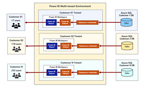

When developing an application that implements App-Owns-Data embedding,
it’s possible to call the Power BI REST API under the identity of a
master user account or under the identity of a service principal.
However, Microsoft strongly recommends using a service principal.

By using a service principal, you can avoid common problems associated
with master user accounts such as experiencing authentication errors in
environments where users are required to log in using multi-factor
authentication (MFA). Using a service principal is also consistent with
the idea that App-Owns-Data embedding is based on leveraging the Power
BI Service using a Platform-as-a-Service (PaaS) mindset as opposed to a
Software-as-a-Service (SaaS) mindset.

### Understanding the 1000 Workspace Limitation

When designing a multitenant environment for App-Owns-Data embedding,
there is a documented limitation that requires your attention. In
particular, the limitation is that neither a user nor a service
principal can be member of more than 1000 workspaces. The purpose of
this limitation has to do with performance. The limitation exists to
ensure code paths don't become inefficient resulting in performance
degradation. A little background might make it easier for you to
understand what's involved.

Behind the scenes, the Power BI Service maintains a set of
security-related metadata for each service principal. The Power BI
Service uses this metadata to track which workspaces and artifacts the
service principal can access. In effect, the Power BI Service maintains
a separate access control list (ACL) for each service principal as part
of its authorization subsystem.

When a service principal calls the Power BI REST API to access a
workspace, the Power BI service runs a security check against the
service principal's ACL to ensure it has the proper authorization. As
you can imagine, the time it takes to determine whether the target
workspace ID is inside the ACL increases as the number of workspaces
increases. The Power BI team created and documented the 1000-workspace
limitation to ensure the authorization metadata (i.e. ACL) for a service
principal (or user) doesn't grow so large that it significantly degrades
performance.

The 1000-workspace limitation isn’t enforced through code in the Power
BI Service. If you try, you'll find you can create 1,200 workspaces
using a single service principal. When you cross over the line from 1000
to 1001 workspaces, nothing really changes. Calls from the service
principal to the Power BI REST API will still execute successfully.
However, it's important to acknowledge that the application has moved
into an "unsupported" state which has implications when trying to get
help from Microsoft support.

To summarize, the scenario in which a service principal owns 1000
workspaces or less is supported. The scenario in which a service
principal owns 1001 workspaces or more is unsupported. However, that's
not the end of the story. Let's look at a simple example to make an
important point.

Consider a scenario in which two multi-tenant applications have each
been implemented to use a single service principal. Now imagine the
first application has created 990 workspaces while the second
application has created 1010 workspaces. From a supportability
standpoint, the first application is within the supported boundaries
while the second application is not.

Now let's compare these two applications purely from a performance point
of view. There's really not that much difference because the ACLs for
both service principals have let the metadata for their ACLs grow to a
point where it will degrade performance to some degree.

Here's the key observation. The number of workspaces created by a
service principal has a direct effect on performance. A service
principal which is a member of 100 workspaces will execute calls on the
Power BI REST API faster than a service principal which is a member of
1000 workspaces. Likewise, a service principal which is a member of only
10 workspaces will execute calls faster than a service principal which
is a member of 100 workspaces. From the perspective of performance and
scalability, the optimal number of workspaces in which a service
principal should be a member is 1.

### Managing Isolation for Datasets and Datasource Credentials

Another important aspect of designing an App-Owns-Data embedding
application for a multitenant environment has to do with maintaining the
required level of isolation across customer tenants. The last thing you
want is for a user from one customer tenant to see data from another
tenant that belongs to a different customer. Therefore, it's critical
that you understand how datasets and datasource credentials are managed
within the Power BI Service.

Each dataset in the Power BI Service has an owner which can be either a
user or a service principal. You can discover who the dataset owner is
by inspecting the **ConfiguredBy** property in the dataset settings
page.

If it's ever required, you can perform a Take Over action to transfer
dataset ownership from one user or service principal to another. If you
import a PBIX file to create a new dataset using a service principal,
the service principal is automatically configured as the dataset owner.

In order to connect a dataset to its underlying datasource, the dataset
owner must set dataset credentials. These datasource credentials are
then cached by the Power BI Service in an encrypted fashion. After that
point, the Power BI Service is then able to use those credentials to
authenticate with the underlying datasource when refreshing the data in
an import-mode dataset or when executing a query with a DirectQuery
dataset.

There is a common pattern used when provisioning a new customer tenant
where the application executes a series of calls running under the
identity of a service principal. The first call creates a new workspace.
The second call associates that workspace with a dedicated capacity.
Next, there is a call to import a PBIX file to create a new dataset.
After importing a PBIX file to create a dataset, a service principal can
then set the dataset source credentials for that dataset. As a result of
these Power BI REST API calls, the service principal is an Admin of the
new workspace and the owner of the dataset and the datasource
credentials.

A common misconception is that datasource credentials in the Power BI
Service are scoped at the workspace level. They are not. Instead,
datasource credentials are scoped by user or by service principal and
their scope extends across all Power BI workspaces in the current Azure
AD tenant. It's possible for a service principal to create datasource
credentials that are used by datasets in different workspaces as shown
in the following diagram.

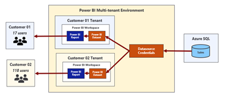

### Design Strategies Before Service Principal Profiles

In this section, we will quickly review the three common design
strategies that have been used to build and manage multitenant
environments for App-Owns-Data embedding. This will give you a better
appreciation of the design problems that service principal profiles have
been designed to solve.

Prior to the introduction of service principal profiles, developers have
built multitenant applications with support for App-Owns-Data embedding
using one the following three design strategies.

* Single service principal
* Service principal pooling
* One service principal per workspace

Now let's review the strengths and weakness of each of these design
strategies starting with single service principal. When an application
is designed to use a single service principal, it requires a one-time
creation of Azure AD application for service principal. Therefore, it
requires less administrative overhead than the other two strategies
because there is no ongoing need to create new Azure AD applications in
order to add more service principals. It is also the easiest strategy to
implement as the other two strategies require extra code to switch the
calling context between service principals when calling the Power BI
REST API.

The obvious problem with the single service principal design strategy is
it doesn't scale. It only supports a multitenant environment that can
grow to no larger than 1000 workspaces. The application will also be
less performant as the service principal becomes a member of a large
number of workspaces. Finally, there is a problem with customer tenant
isolation because there is a single service principal that will be the
owner of every dataset and all data credentials across all customer
tenants.

Service principal pooling provides a commonly-used strategy to get
around the 1000-workspace limitation. The main idea is that the
application can scale to any number of required workspaces by adding the
correct number of service principals to the pool. For example, a pool of
5 service principals makes it possible to scale up to 5,000 workspaces.
A pool of 80 service principals makes it possible to scale up to 80,000
workspaces.

While service principal pooling can scale to a large number of
workspaces, it has several disadvantages. First, it requires extra code
and metadata to implement context switching between service principals
when calling the Power BI REST API. Second, there is more administrative
overhead as it will be necessary to create new Azure AD applications
whenever it's necessary to increase the number of the service principals
in the pool.

The service principal pooling strategy is not optimized for performance
because it allows service principals to become members of 100s of
workspaces. It also is not ideal from the perspective of customer tenant
isolation. While it's slightly better than the single service principal
strategy, there is still the issue where each service principal will the
owner of datasets and datasource credentials across many different
customer tenants which compromises isolation.

The final strategy is the one that involves creating a new service
principal for each new customer tenant. From a theoretical standpoint,
this is the best solution because it optimizes the performance of calls
to the Power BI REST API while also providing true isolation for
datasets and datasource credentials at the workspace level. However,
what works best in theory doesn't always work best in practice. This is
a good example.

The strategy of creating a new service principal for each new customer
tenant is impractical for most large organizations. That's because these
organizations require formal approval processes or they introduce other
bureaucratic red tape for creating new Azure AD applications. This makes
it impossible to grant a custom application the authority it needs to
create new Azure AD applications on-demand in an automated fashion which
is a requirement when using this strategy.

In less-common scenarios where a custom application is granted the
proper permissions, it can use the Microsoft Graph API to create new
Azure AD applications on demand. This type of custom application becomes
more complex to develop and deploy because it must somehow track
authentication credentials for each Azure AD application and gain access
to those credentials whenever it needs to authenticate and acquire
access tokens for individual service principals. The
[TenantManagement](https://github.com/PowerBiDevCamp/TenantManagement)
sample application demonstrates using this approach.

## Introduction to Service Principal Profiles

The previous section discussed three essential problems that need to be
addressed when developing a multitenant application that uses
App-Owns-Data embedding. Here is a summary of those three problems.

* Scaling to a large number of workspaces
* Optimizing performance in calls to the Power BI REST API
* Isolating datasets and datasource credentials at the customer tenant level

The Power BI embedding team created the service principal profiles
feature to solve these three problems with the lowest amount of
developer effort and overhead. As you will see, designing a multitenant
application using service principal profiles will combine the strengths
of the three design strategies discussed in the previous section while
avoiding the weaknesses. Now it's time to drill down into a discussion
about how service principal profiles work.

Service principal profiles are local accounts which are created within
the context of the Power BI Service. A service principal can use the new
**[Profiles](https://docs.microsoft.com/en-us/rest/api/power-bi/profiles)**
endpoint of the Power BI REST API to create new service principal
profiles. This makes it possible for a service principal to create and
manage its own set of service principal profiles for a custom
application as shown in the following diagram.

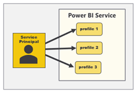

Later in this article, you will learn how to write code to create
service principal profiles as well as how to execute Power BI REST API
calls under the identity of a service principal profile. However, it's
now time to make a general observation. While the service principal
itself and its underlying Azure AD application are known to Azure AD,
Azure AD doesn't know anything about service principal profiles.
Instead, service principal profiles are created by the Power BI Service
and they only exist within the context of the Power BI Service subsystem
which controls security and authorization.

There will always be a parent-child relationship between a service
principal and the service principal profiles it creates. A service
principal profile can never be created as a stand-alone entity. Instead,
each service principal profile must be created by specific service
principal and that service principal will serve as the profile's parent.
Furthermore, a service principal is never visible to users or other
service principals. A service principal profile can only be seen and
used by the service principal that created it.

### Service Principal Profiles as First-class Power BI Security Principals

The second important observation is that a service principal profile is
first-class security principal in the Power BI authorization system. The
Power BI Service treats a service principal profile like a user or a
service principal in the sense that a profile can be added to a
workspace as a member. A service principal profiles can also be the
owner of a dataset and the owner of datasource credentials. This leads
to the best practice of creating a new service principal profile for
each new customer tenant as shown in the following diagram.

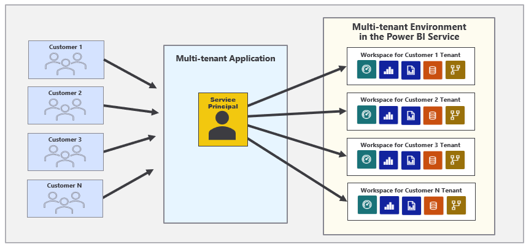

When you develop a custom application using service principal profiles,
you only need a single Azure AD application which provides your
application with a single service principal. This lowers administrative
overhead compared to previous strategies because there is no ongoing
need to create additional Azure AD applications after the application
goes into production.

### Executing Power BI REST API Calls as a Service Principal Profile

You can execute Power BI REST API calls under the identity of a service
principal profile. That means you can execute the sequence of API calls
under the identity of a service principal profile when provisioning a
new customer tenant. Let's examine this idea in a little more detail.

If you execute a Power BI REST API call under the identity of a service
principal profile to create a new workspace, that profile will
automatically be configured as a workspace member in the role of Admin.
If you execute a call under the identity of a service principal profile
to import a PBIX file and create a dataset, that profile will be
configured as the dataset owner. If you execute call under the identity
of a service principal profile to set datasource credentials, the
profile will be configured as the owner of the datasource credentials.

Programming with service principal profiles might seem a little
complicated at first. You can execute API calls under the identity of a
service principal profile and you can also execute API calls without a
profile which execute under the identity of the parent service
principal. It's important to understand that a service principal has an
identity in the Power BI Service that is separate and distinct from the
identities of its profiles.

Now let's discuss a common programming pattern when developing a
multitenant application using service principal profiles. Start by
asking yourself this question. When do you execute Power BI REST API
calls as the parent service principal versus when do you execute API
calls a child service principal profile? It turns out this isn’t too
complicated once you understand the basic programming pattern.

You should execute API calls as the parent service principal when you
are creating, viewing and deleting service principal profiles. However,
most of the other API calls should be executed as a service principal
profile. This includes API calls to create workspaces and import PBIX
files. It also includes API calls to update dataset parameters and to
set datasource credentials. Finally, it includes API calls to query for
workspace artifacts and to generate embed tokens.

Let's walk through a simple example. Imagine you need to create a new
customer tenant for a customer named Contoso. The first step is to
execute an API call to create a new service principal profile with a
display name of Contoso. That first call is made under the identity of
the service principal. However, all the remaining Power BI REST API
calls shown in the following list should be made under the identity of
the service principal profile that has just been created.

* Create workspace
* Associated workspace with capacity
* Import PBIX
* Update dataset parameters
* Set credentials
* Start refresh

Now, let's make one final observation. Each customer tenant is built
using a Power BI workspace and a set of artifacts that are all owned and
managed by one specific service principal profile. In order to access
that Power BI workspace and its content at a later time, you must
execute API calls using the identity of the same service principal
profile that was used to create the customer tenant.

And what about the service principal itself? Does the service principal
require any access to the workspaces for customer tenants and the
content inside? The answer is no, the service principal itself doesn't
need any access at all. Remember, Power BI REST API calls executed under
the identity of the service principal are mainly used to create and
manage service principal profiles. API calls for workspace creation and
content access are executed as a service principal profile.

### Using the Profiles API to create and manage service principal profiles

The Power BI embedding team has introduced a new **Profiles** API which
is used to create and manage service principal profiles. You can find
the documentation for the **Profiles** API at the following URL.

**https://docs.microsoft.com/en-us/rest/api/power-bi/profiles**

The **Profiles** API contains the following operations.

* Create Profile
* Delete Profile
* Get Profile
* Get Profiles
* Update Profile

Let's begin by looking at the Create Profile operation. The following
table shows the details required for executing an HTTP POST request
against the **Profiles** endpoint to create a new service principal
profile.

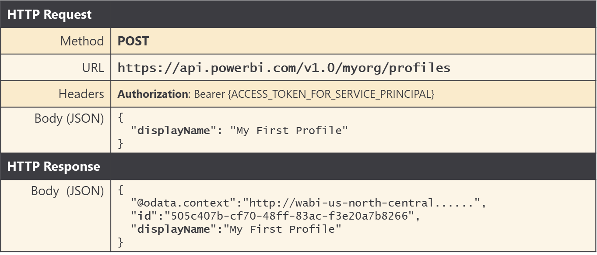

Note that you must pass a **displayName** property in the request body
to provide a display name for the new tenant. The **displayName** must
be unique across all the profiles owned by a specific service principal.

The API call to create a new service principal profile returns an **id**
property with a GUID which represents the profile id. When developing
applications that use service principal profiles, it's a best practice
to store profile display names and ids in a custom database so the
application can lookup the id for a service principal profile whenever
it's required.

If you are programming with the Power BI .NET SDK, you can call
**Profile.CreateProfile** which returns a new
**ServicePrinicpalProfile** object which makes it possible to discover
the **id** property value of the new profile.

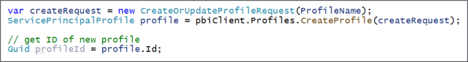

When you need to delete a service principal profile, you can execute an
HTTP DELETE operation in which the profile id is parsed into the end of
the URL.

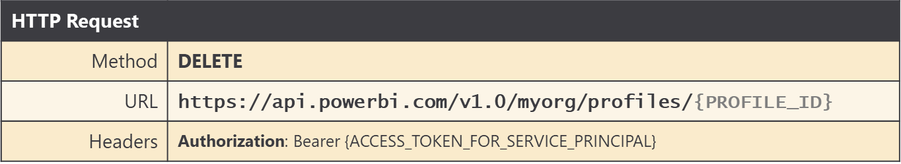

If you are programming with the Power BI .NET SDK, you can call
**Profile.DeleteProfile** using the following code.


If you need to query the set of service principal profiles associated
with the current service principal, you can execute an HTTP GET
operation against the **Profiles** endpoint. This API calls returns a
JSON payload with the **id** and **displayName** of each service
principal profile.


If you are programming with the Power BI .NET SDK, you can call
**Profile.GetProfiles** using the following code.


Let's say you've just created a new service principal profile and you'd
like to add it as a member of a workspace to give it access. You can
execute an HTTP POST operation in which the request body provides the
following JSON with an **identifier** property with the service
principal object ID and an inner **profile** object with an **id**
property that contains the profile Id.

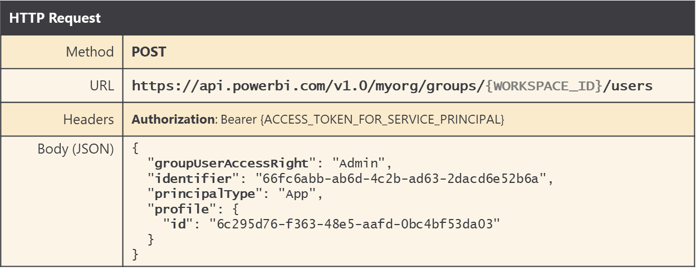

If you are programming with the Power BI .NET SDK, you can use the
following code to add a service principal profile as a workspace member
in the role of Admin.

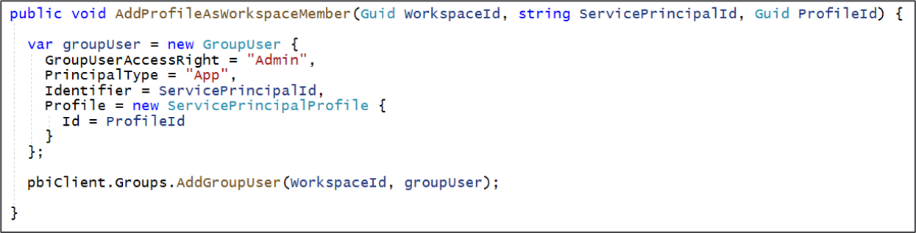

If you inspect the **Access** pane for a Power BI workspace in the Power
BI Service, you can determine which accounts have been added as members.
The following screenshot shows the **Access** pane for a workspace whose
membership includes a user and a service principal profile with a
display name of Contoso.


### Executing API Calls under the Identity of a Service Principal Profile

There are two requirements for executing Power BI REST API calls under
the identity of a service principal profile. First, you need to pass the
access token for the parent service principal in the **Authorization**
header. Second, you need to include a header named
**X-PowerBI-profile-id** with the value for the service principal
profile Id.

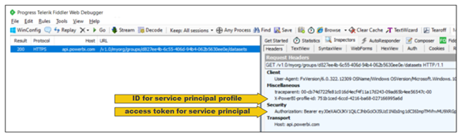

If you are using the Power BI .NET SDK, you can set the
**X-PowerBI-profile-id** header value explicitly with the GUID for
service principal profile Id using the following code.

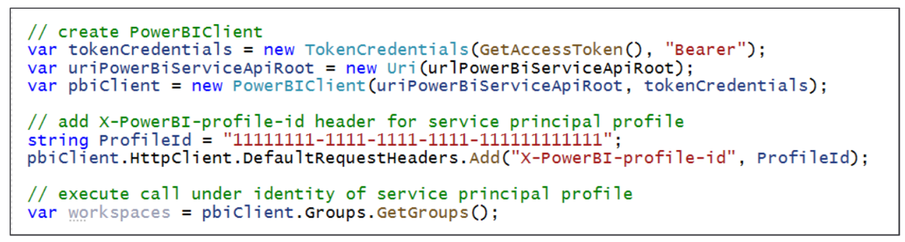

As you can see from the previous code listing, once you have added the
**X-PowerBI-profile-id** header to the **PowerBIClient** object, you can
just call Power BI REST API operations such as **Groups.GetGroups** as
you normally would and the call will be executed under the identity of a
service principal profile.

There is a second way to set the **X-PowerBI-profile-id** header for a
**PowerBIClient** object. More specifically, you can initialize a
**PowerBIClient** object by passing the GUID for a profile id in the
constructor using this code.

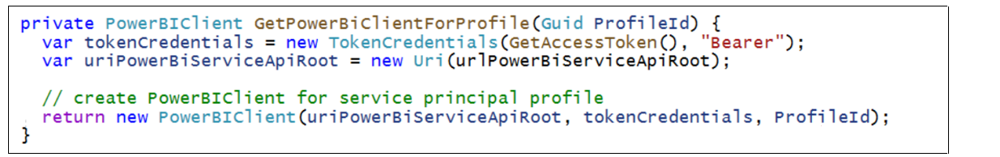

As you program a multitenant application, you need to switch back and
forth between executing calls as the parent service principal and
executing calls as a service principal profile. One strategy to manage
context switching is to use a class-level **PowerBIClient** property
named **pbiClient** and a method named **SetCallingContext** which can
be called to switch between caller identities.


Now, let's say you need to create or manage a service principal profile.
You can call **SetCallingContext** without any parameter so calls
afterwards will execute under the identity of the service principal.

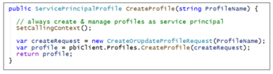

When you need to create and configure a new workspace for a new customer
tenant, you want to execute that code as a service principal profile.
Therefore, you should call **SetCallingContext** and pass the profile id
so that Power BI REST operations called afterwards are executed as a
service principal profile and not as the parent service principal.

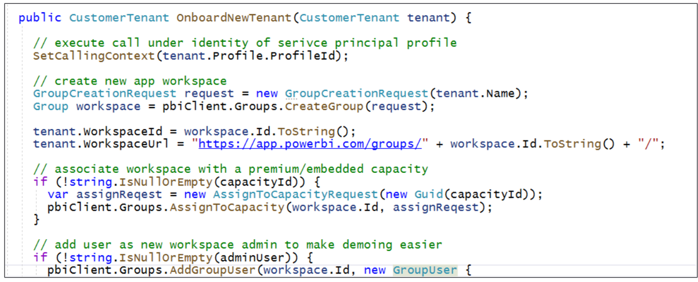

Once you have used a specific service principal profile to create and
configure a workspace, you should use that same service principal
profile later when you need to consume content from that workspace. The
following code shows how to execute code as a service principal profile
when retrieving embedding metadata and an embed token used to embed a
report on a web page.

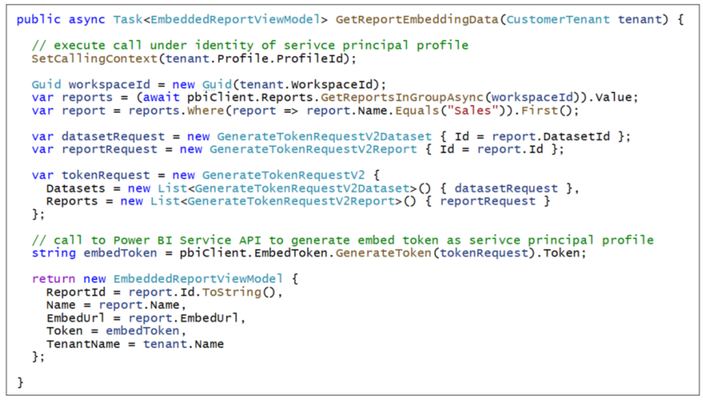

## Getting Started with the **AppOwnsDataMultiTenant** application

The **AppOwnsDataMultiTenant** application demonstrates how to manage a
multitenant environment for Power BI embedding using service principal
profiles. This sample application has been designed to use the best
practice of creating a separate service principal profile for each new
customer tenant.

The design strategy used by the **AppOwnsDataMultiTenant** application
optimizes calls to the Power BI REST API while also providing complete
dataset and datasource credential isolation at the customer tenant
level. The design of the **AppOwnsDataMultiTenant** application makes it
possible to scale upwards to manage an environment with up to and beyond
100,000 customer tenants.

The **AppOwnsDataMultiTenant** application provides a form which allows
the user to create a new customer tenant. When using the application,
you can enter the **Tenant Name** for a new customer and the details of
the customer's database.

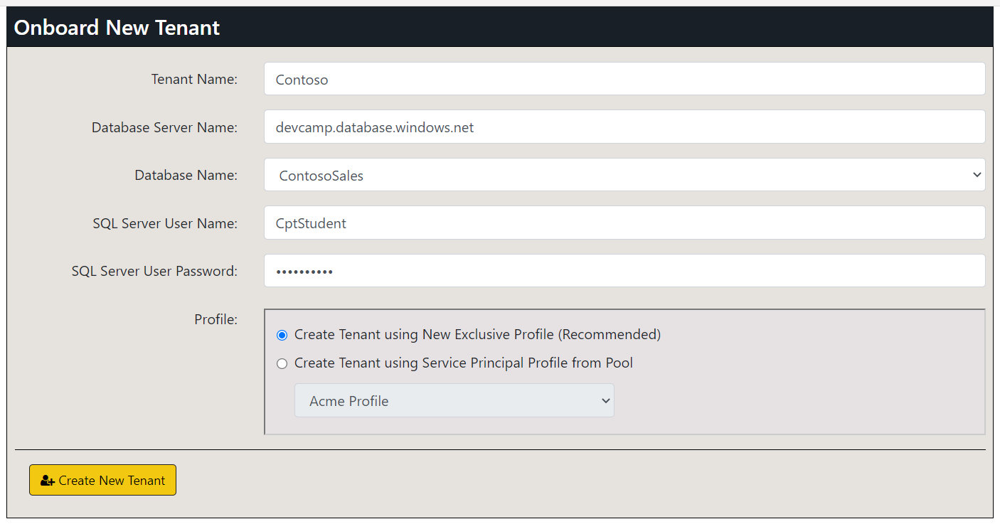

When you click the **Create New Tenant** button, the application
responds by executing code which begins by creating a new service
principal profile using the same name as the **Tenant Name**. After
creating the service principal profile, the application then switches
contexts and begins calling the Power BI REST API using that profile's
identity to create a new workspace and populate it with content. This
application design maintains a one-to-one relationship between service
principal profiles and customer tenant workspaces which is what
Microsoft recommends as a best practice.

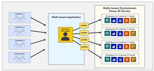

Keep in mind that **AppOwnsDataMultiTenant** is a proof-of-concept (POC)
that doesn't include certain behavior that would be required in any
real-world application. In particular, this application was not designed
to authenticate or authorize the user. You can access all the pages of
this application with anonymous access. If you are going to use the
**AppOwnsDataMultiTenant** application as a starting point for something
you are building, it will be your responsibility to add the code
required to authenticate and authorize users who will be responsible for
creating and managing customer tenants.

### Setting up your development environment

You can follow the steps in this section to set up
the **AppOwnsDataMultiTenant** application for testing. To complete
these steps, you will require a Microsoft 365 tenant in which you have
permissions to create and manage Azure AD applications and security
groups. You will also need Power BI Service administrator permissions to
configure tenant-level settings for Power BI to enable service
principals and service principal profiles with the ability to access the
Power BI Service API. If you do not have a Microsoft 365 environment for
development and testing, you can create one with free trial licenses by
following the steps in **[Create a Development Environment for Power BI
Embedding](https://github.com/PowerBiDevCamp/Camp-Sessions/raw/master/Create%20Power%20BI%20Development%20Environment.pdf)**.

To set up the **AppOwnsDataMultiTenant** application for testing, you
will need to configure a Microsoft 365 environment with an Azure AD
tenant by completing the following tasks.

* Create an Azure AD security group named **Power BI Apps**
* Configure Power BI tenant-level settings for service principal access
* Configure Power BI tenant-level settings to enable service principal profiles
* Create and configure the Azure AD Application for the **AppOwnsDataMultiTenant** Application

### Create an Azure AD security group named Power BI Apps

Begin by navigating to the **[Groups management
page](https://portal.azure.com/#blade/Microsoft_AAD_IAM/GroupsManagementMenuBlade/AllGroups)** in
the Azure portal. Once you get to the **Groups** page in the Azure portal, click the **New group** link.

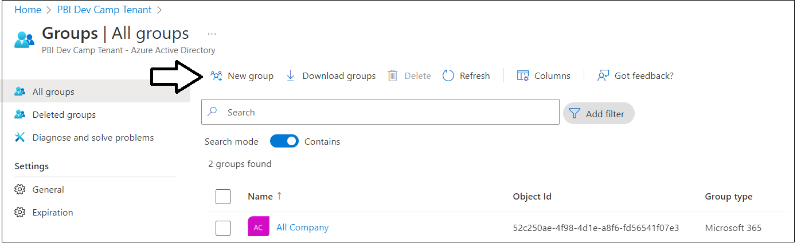

In the **New Group** dialog, Select a **Group type** of **Security** and
enter a **Group name** of **Power BI Apps**. Click the **Create** button
to create the new Azure AD security group.

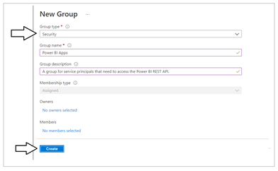

It might take a minute or two before the group appears. Refresh the
**All Groups** page a few times until you can verify that you can see
the new security group named **Power BI Apps** in the list of groups.

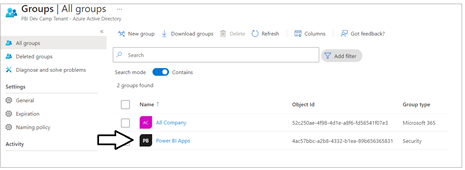

### Configure Power BI tenant-level settings for service principal profile access

Next, you need you enable a tenant-level setting for Power BI
named **Allow service principals to use Power BI APIs**. Navigate to the
Power BI Service admin portal at <https://app.powerbi.com/admin-portal>.
In the Power BI Admin portal, click the **Tenant settings** link on the
left.


Move down in the **Developer settings** section and expand the **Allow
service principals to use Power BI APIs** section.


Note that the **Allow service principals to use Power BI APIs** setting
is initially set to **Disabled**.


Change the setting to **Enabled**. After that, set the **Apply
to** setting to **Specific security groups** and add the **Power BI
Apps** security group as shown in the screenshot below. Click
the **Apply** button to save your configuration changes.


You will see a notification indicating it might take up to 15 minutes to
apply these changes to the organization.


Now look down in the **Developer setting** section of the Power BI admin
portal and locate and expand the section titled **Allow service
principals to create and use profiles**.

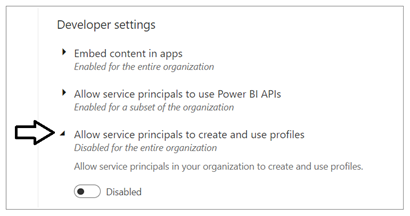

Change the setting to **Enabled**. After that, set the **Apply
to** setting to **Specific security groups** and add the **Power BI
Apps** security group as shown in the screenshot below. Click
the **Apply** button to save your configuration changes.

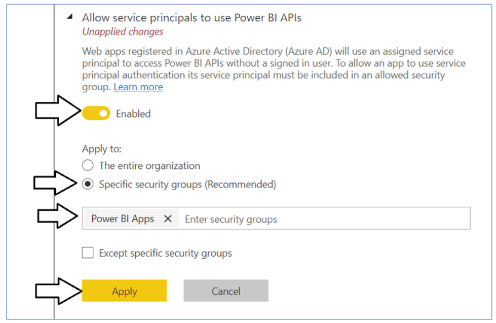

You will see another notification indicating it might take up to 15
minutes to apply these changes to the organization. Now scroll upwards
in the **Tenant setting** section of the Power BI admin portal and
locate **Workspace settings**.

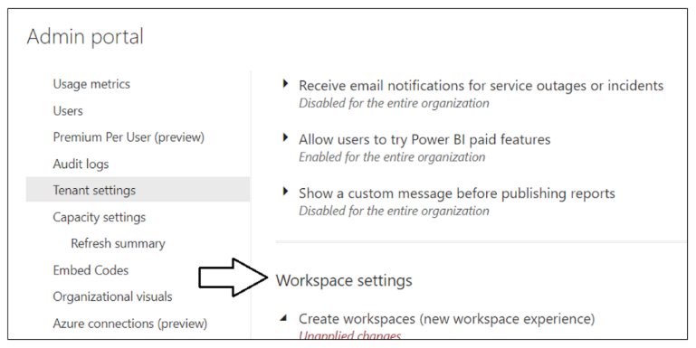

Note that a Power BI tenant has an older policy by default where users
require permissions to create Office 365 groups in order to create new
Power BI workspaces. You must reconfigure this setting so that service
principal profiles will be able to create new workspaces.

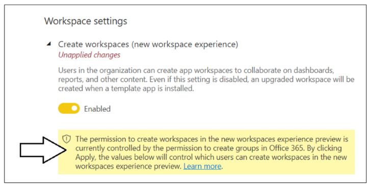

In **Workspace settings**, set **Apply to : The entire
organization** and click the **Apply** button to save your changes.

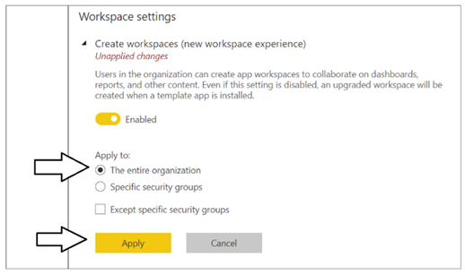

There is one more tenant-level setting that must be enabled for the
**AppOwnsDataMultiTenant** application to work correctly. That is the
tenant-level setting which makes it possible to use map visuals. Locate
the **Integration settings** section in **Tenant settings**. Inside the
that section locate and expand the setting named **Map and filled map
visuals**.

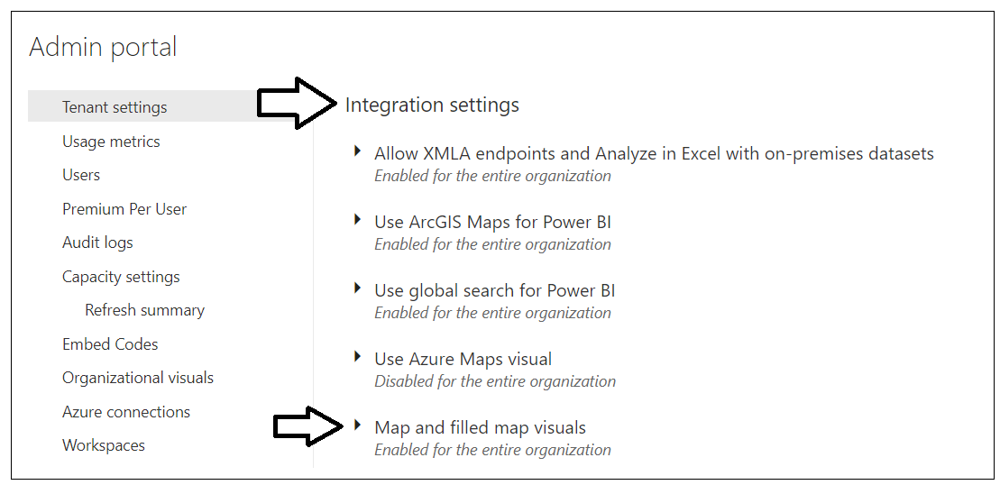

Enable the **Map and filled map visuals** setting and then click **Apply**.

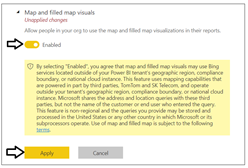

You have now completed the configuration of Power BI tenant-level
settings. Now you can move ahead to create the Azure AD application that
will be used by the **AppOwnsDataMultiTenant** application.

### Create the Azure AD Application for the **AppOwnsDataMultiTenant** Application

Login to the Azure portal to create the new Azure AD application. Begin
by navigating to the [App
registration](https://portal.azure.com/#blade/Microsoft_AAD_IAM/ActiveDirectoryMenuBlade/RegisteredApps) page
in the Azure portal and click the **New registration** link.

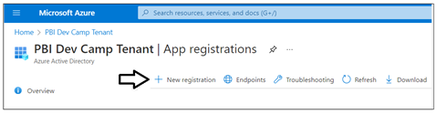

On the **Register an application** page, enter an application name such
as **Power BI Embedding Tenant Manager** and accept the default
selection for **Supported account types** of **Accounts in this
organizational directory only**.

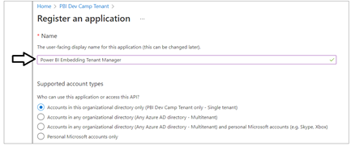

Complete the following steps in the **Redirect URI** section.
* Set the dropdown selection to **Web** in the dropdown box
* Do not enter a value for the **Redirect URI**. Leave it blank.
* Click the **Register** button to create the new Azure AD application.

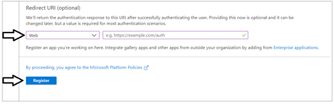

After creating a new Azure AD application in the Azure portal, you
should see the Azure AD application overview page which displays
the **Application ID**. Note that the ***Application ID*** is often
called the ***Client ID***, so don't let this confuse you. You will need
to copy this Application ID and store it so you can use it later to
configure the project's support for Client Credentials Flow.

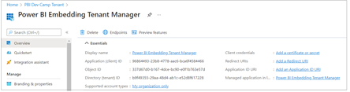

Copy the **Tenant ID** (aka Directory ID) and paste it into a text
document so you can use it later in the setup process. Note that
this **Tenant ID** value will be used
by **AppOwnsDataMultiTenant** project to configure authentication with
Azure AD.

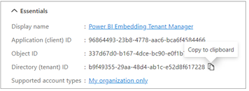

Next, repeat the same step by copying the **Client ID** and copying that
into the text document as well.

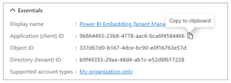

Your text document should now contain the **Tenant ID** and **Client
ID**  as shown in the following screenshot.

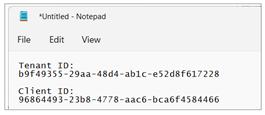

Next, you need to create a Client Secret for the application. Click on
the **Certificates & secrets** link in the left navigation to move to
the **Certificates & secrets** page. On the **Client secrets** tab,
click the **New client secret** button as shown in the following
screenshot.

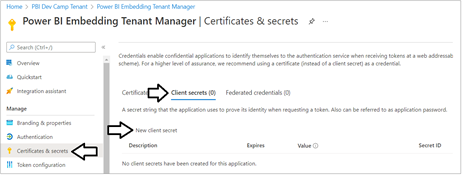

In the **Add a client secret** dialog, add a text description such
as **Test Secret** and then click the **Add** button to create the new
Client Secret.

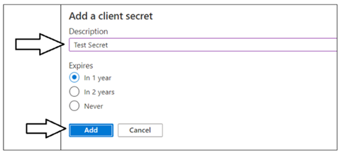

Once you have created the Client Secret, you should be able to see
its **Value** in the **Client secrets** section. Click on the **Copy to
clipboard** button to copy the **Value** for the **Client Secret** into
the clipboard.

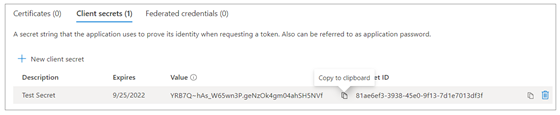

Paste the **Client Secret** into the same text document with
the **Client ID** and **Tenant ID**.

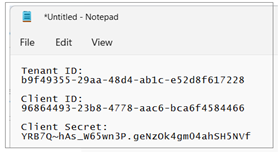

At this point, you have the Tenant Id, Client Id and Client Secret. This
is all you need to authenticate with Azure AD to acquire an access token
for the service principal. However, you need to capture one more GUID
for the service principal object Id. You will need this Id value in any
scenario where you need to add the service principal of one of its
profiles as a member in a Power BI workspace.

Navigate back to the Overview page for the new Azure AD application.
Click the **Managed application in local directory** link as shown in
the following screenshot to navigate to the application's **Properties**
page.

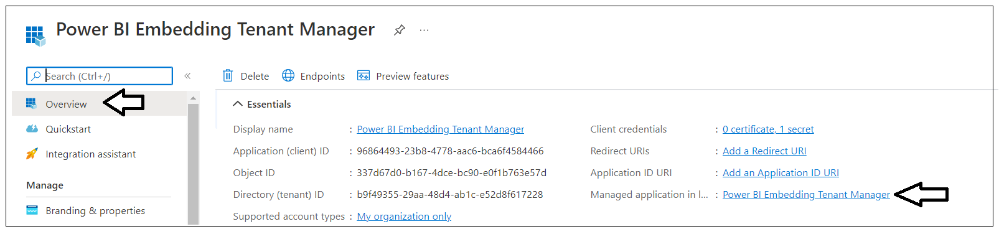

On the **Properties** page, locate the **Object ID** value and copy it
to the clipboard. This value represents the service principal object Id.

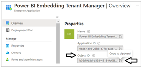

Now paste the service principal into the text document with the other
values as shown in the following screenshot.

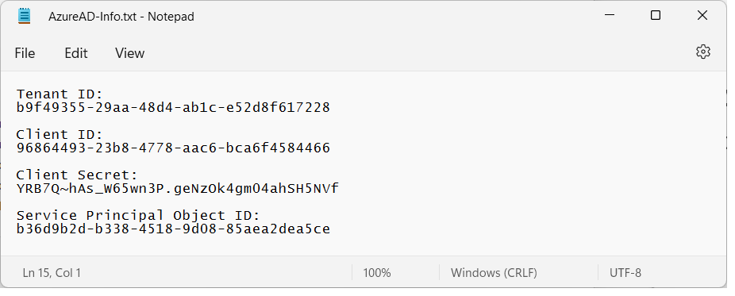

Save the text file so you don’t accidently close it and lose the
configuration data inside. You will copy and paste these Id values into
the **AppOwnsDataMultiTenant** project later when you set up the
application for testing.

### Add the Azure AD Application to the Power BI Apps Group

In this step you will finalize the configuration in Azure AD by adding
the **Power BI Embedding Tenant Manager** application to the **Power BI
Apps** security group. Navigate back to the [Groups management
page](https://portal.azure.com/#blade/Microsoft_AAD_IAM/GroupsManagementMenuBlade/AllGroups) 
and locate the security group created earlier named **Power BI Apps**.
Click on the **Power BI Apps** link to drill into the summary page for
this security group.

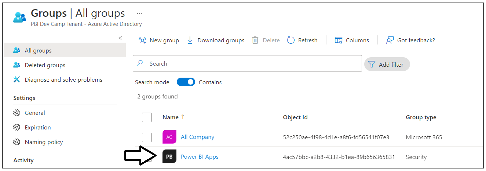

On the **Power BI Apps** security group summary page, click the
**Members** link to navigate to the **Members** page.

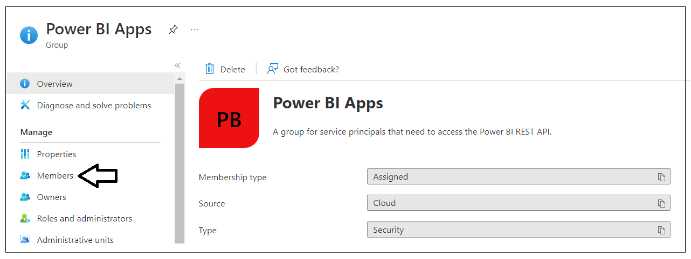

On the **Members** page, click the **Add members** link to display the
**Add members** pane.

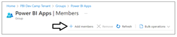

In the **Add members** pane, locate and select the **Power BI Embedding
Tenant Manager** application. Add this application to the **Power BI
Apps** security group.

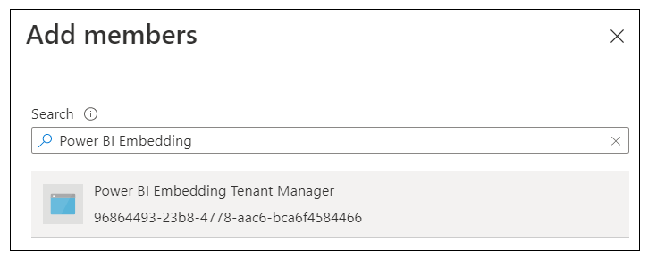

Verify that the **Power BI Embedding Tenant Manager** application is now
a member of the **Power BI Apps** group.

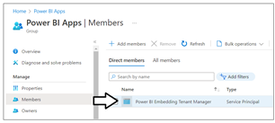

You are now finished in configuring Azure AD for the application setup.

## Set Up the AppOwnsDataMultiTenant Application in Visual Studio 2022

In order to run and test the **AppOwnsDataMultiTenant** project on a
developer workstation, you must install the .NET 6 SDK and/or Visual
Studio 2022. If you use Visual Studio 2022, you can use any edition
including the free Community edition. While this document will walk
through the steps of opening and running the this project using Visual
Studio 2022, you can also open and run the project using Visual Studio
Code if you prefer that IDE.

Here are links to download this software if you need them.

* .NET 6 SDK – \[[**download**](https://dotnet.microsoft.com/en-us/download/dotnet/6.0)\]
* Visual Studio 2022 – \[[**download**](https://visualstudio.microsoft.com/downloads/)\]
* Visual Studio Code – \[[**download**](https://code.visualstudio.com/download)\]

### Download the Source Code

The source code for **AppOwnsDataMultiTenant** is maintained in a GitHub
repository at the following URL.

> [**https://github.com/PowerBiDevCamp/AppOwnsDataMultiTenant**](https://github.com/PowerBiDevCamp/TenantManagement)

You can download the **AppOwnsDataMultiTenant** project source files in
a single ZIP archive using **[this
link](https://github.com/PowerBiDevCamp/AppOwnsDataMultiTenant/archive/refs/heads/main.zip)**.
If you are familiar with the **git** utility, you can clone the project
source files to your local developer workstation using the
following **git** command.

```
git clone https://github.com/PowerBiDevCamp/AppOwnsDataMultiTenant.git
```

Once you have downloaded the source files for
the **AppOwnsDataMultiTenant** repository to your developer workstation,
you will see there is a top-level project folder
named **AppOwnsDataMultiTenant** which contains several files including
a solution file named **AppOwnsDataMultiTenant.sln** and a project file
named **AppOwnsDataMultiTenant.csproj**.

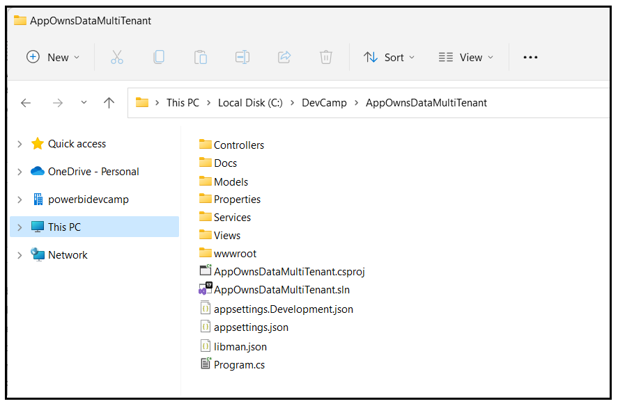

### Open the Project in Visual Studio 2022

Launch Visual Studio 2022 and use the **File \> Open \>
Project/Solution** menu command to open the solution file
named **AppOwnsDataMultiTenant.sln**. You should note that this
development project has been built as a .NET 6 MVC Web Application as
shown in the following screenshot.


Let's quickly review the NuGet packages that have been installed in
the **AppOwnsDataMultiTenant** project. There are several NuGet packages
which add Entity Framework support which makes it possible to quickly
create the SQL Server database associated with this project. There is a
package included to add Azure AD authentication support named
**Microsoft.Identity.Web**. The package
named **Microsoft.PowerBI.Api** is the Power BI .NET SDK which has been
included to support .NET programming with the Power BI REST API.

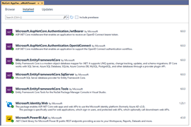

### Update application settings in the appsettings.json file

Before you can run the application in the Visual Studio debugger, you
must update several critical application settings in
the **appsettings.json** file. Open the **appsettings.json** file and
examine the JSON content inside. There are three important sections
named **AzureAd**, **AppOwnsDataMultiTenantDB** and **DemoSettings**.

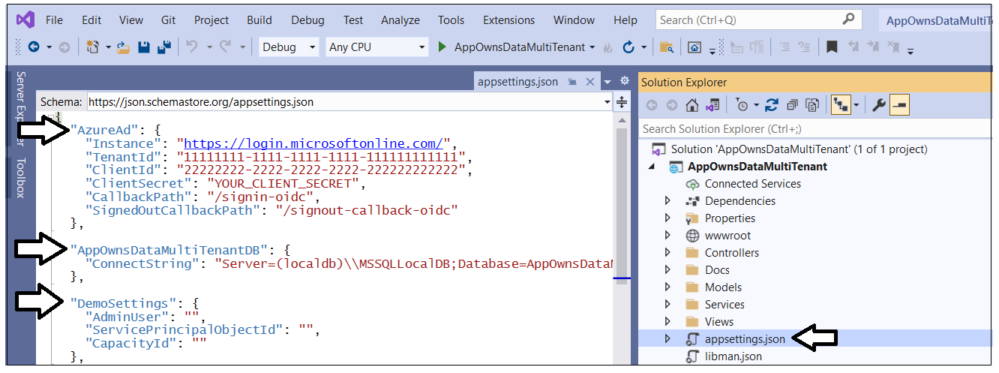

Inside the **AzureAd** section, update
the **TenantId**, **ClientId** and **ClientSecret** with the data you
collected when creating the Azure AD application named **Power BI Tenant
Management Application.**

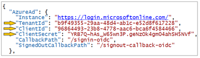

Now let's examine the **AppOwnsDataMultiTenantDB** section and the
setting inside named **ConnectString**. This is the connection string
that will be used by the Entity Framework to create the SQL Server
database that will be used by the **AppOwnsDataMultiTenant**
application. If you are using Visual Studio 2022, you should be able
leave the database connection string the way it is with
the **Server** setting of **(localdb)\\\\MSSQLLocalDB**. If you'd rather
create the **AppOwnsDataMultiTenantDB** database in a different
location, you can update the value of this connection string to point to
a different server.


In the **DemoSettings** section there is a property named **AdminUser**.
The reason that this property exists has to with you being able to view
and examine Power BI workspaces as they are created by service principal
profiles. There is code in the **AppOwnsDataMultiTenant** application
that will add the user specified by the **AdminUser** setting as a
workspace admin any times it creates a new Power BI workspace. This just
makes things much easier for you to see what's going on when you begin
to run and test the application.

Update the **AdminUser** setting with your Azure AD account name so that
you will be able to see all the Power BI workspaces created by this
application.


In the **DemoSettings** section there is a property
named **ServicePrincipalObjectId**. The reason this property exists has
to do with adding the service principal or a service principal profile
as a workspace member. Update the **ServicePrincipalObjectId** setting
with the value you Service Principal Object Id value you collected
earlier.


In the **DemoSettings** section there is a property
named **CapacityId**. The reason this property exists has to do with
automating the step of associating new workspaces with a premium
capacity. If you have the GUID-based ID for a premium capacity, you can
update this setting and the application will automatically associate new
workspaces with this capacity each time it creates a new workspace. If
you don't have a Capacity ID, that is not a problem. Simply leave the
**CapacityId** setting as an empty string and the application will
ignore this setting.

Once you have made your changes. save and close
the **appsettings.json** file. You are now ready to move on to the step
where you will create the new database named
**AppOwnsDataMultiTenantDB**.

### Create the AppOwnsDataMultiTenantDB database

When developing with service principal profiles, it's a common practice
to use a custom database to track service principal profiles and
customer tenants. The **AppOwnsDataMultiTenant** application has been
designed with a SQL Server database named **AppOwnsDataMultiTenantDB**
which will provide two tables named **Profiles** and **Tenants** to
track service principal profiles and customer tenants as they are
created by the application.

Before you can run the application in Visual Studio, you must create the
**AppOwnsDataMultiTenantDB** database. This database schema has been
created using the .NET 6 version of the Entity Framework. In this step,
you will execute two PowerShell cmdlets provided by Entity Framework to
create the database.

Before creating the **AppOwnsDataMultiTenantDB** database, take a moment
to understand how it’s been structured. Start by opening the file
named **AppOwnsDataMultiTenantDB.cs** in the **Models** folder. Note
that you shouldn't make any changes to **AppOwnsDataMultiTenantDB.cs**.
You are just going to inspect the file to understand how
the **AppOwnsDataMultiTenantDB** database is structured.


When you inspect the code inside **AppOwnsDataMultiTenantDB.cs**, you
will see a class named **AppOwnsDataMultiTenantDB** that derives
from **DbContext**. This class adds support for automatic database
generation using Entity Framework.
The **AppOwnsDataMultiTenantDB** class serves as the top-level class for
the Entity Framework which contains two **DBSet** properties
named **Profiles** and **Tenants**.


When you generate the database, each of these **DBSet** properties will
be created as database tables. The **Profiles** table is generated using
the table schema defined by the **AppProfile** class.


As you saw earlier, Power BI tracks an **id** and **displayName**
property for each profile. The **AppProfile** class defines
**ProfileName** and **ProfileId** to track these properties. However,
the **AppProfile** class defines two extra properties named
**Exclusive** and **Created** so that application can track addition
metadata about each service principal profile it creates.

The **Tenants** table is generated using the table schema defined by
the **CustomerTenant** class.


After you have inspected the code used to generated the database, close
the source file named **AppOwnsDataMultiTenantDB.cs** without saving any
changes. The next step is to run the PowerShell commands to create the
project database named **AppOwnsDataMultiTenantDB**.

Open the Package Manager console using **Tools \> NuGet Package Manager
\> Package Manager Console**.


You should see the **Package Manager Console** command prompt where you
can execute PowerShell commands.


Type and execute the following **Add-Migration** command to create a new
Entity Framework migration in the project.

Add-Migration InitialCreate

The **Add-Migration** command should run without errors. If this command
fails you might have to modify the database connection string
in **appsettings.json**.


After running the **Add-Migration** command, you will see a new folder
has been added to the project named **Migrations** with several C#
source files. There is no need to change anything in these source files
but you can inspect what's inside them if you are curious how the Entity
Framework does its work.


Return to the **Package Manager Console** and run the
following **Update-Database** command to generate the database
named **AppOwnsDataMultiTenantDB**.

Update-Database

The **Update-Database** command should run and generate the database
named **AppOwnsDataMultiTenantDB**.


In Visual Studio, you can use the **SQL Server Object Explorer** to see
the database that has just been created. Open the **SQL Server Object
Explorer** by invoking the **View \>** **SQL Server Object
Explorer** menu command.


Expand the **Databases** node for the server you are using and verify
you an see the new database named **AppOwnsDataMultiTenantDB**.


If you expand the **Tables** node for **AppOwnsDataMultiTenantDB**, you
should see the two tables named **Profiles** and **Tenants**.


The **AppOwnsDataMultiTenantDB** database has now been set up and you
are ready to run the application in the Visual Studio debugger.

## Test the AppOwnsDataMultiTenant Application

Launch the **AppOwnsDataMultiTenant**  application in the Visual Studio
debugger by pressing the **{F5}** key or clicking the Visual
Studio **Play** button with the green arrow and the
caption **AppOwnsDataMultiTenant**.


When the application starts, you should see its welcome page as shown in
the following screenshot.


### Create Customer Tenants

Now it's time to create your first customer tenant. Start by navigating
to the **Tenants** page.


Click the **Onboard New Tenant** button to display the **Onboard New
Tenant** page.


On the **Onboard New Tenant** page, enter a **Tenant Name** of
**Wingtip**. Leave all the other input elements with their default
values. Click to **Create New Tenant** button to begin the process of
creating a new customer tenant.


What happens when you click the **Create New Tenant** button? The
**AppOwnsDataMultiTenant** application uses the Power BI REST API to
create a service principal profile using same name as **Tenant Name**.
After the service principal profile is created, the application then
switches contexts and executes the following API calls under the
identity of the new service principal profile.

-   Create a new Power BI workspace

-   Upload a [template PBIX
    file](https://github.com/PowerBiDevCamp/AppOwnsDataMultiTenant/raw/main/wwwroot/PBIX/DatasetTemplate.pbix) to
    create the **Sales** dataset and the **Sales** report

-   Update dataset parameters on **Sales** dataset to point to this
    customer's database

-   Patch credentials for the SQL datasource used by
    the **Sales** dataset

-   Start a refresh operation on the **Sales** database

While this work is going on, the application's user is shown an animated
image.


After a few seconds, you should see the new customer tenant has been
created.


Click the **Onboard New Tenant** button again to create a second tenant.
This time, set **Tenant Name** to **Contoso** and select
**ContosoSales** from the dropdown list for **Database Name**. After
that, click **Create New Tenant**.


You should now have two customer tenants. Note that each tenant has been
created using a different profile.


Click the **Profiles** link to examine each of the profiles that have
been created.


Let's examine what has been stored in the **Profiles** table in
**AppOwnsDataMultiTenantDB** database. Note that **ProfileName** column
serves as the primary key of the **Profiles** table


The application also added new records to the **Tenants** table. Note
that the **ProfileName** column in the **Tenants** table serves as a
foreign key so that each record in **Tenants** is associated with
exactly one record in **Profiles**.


Now click the **Power BI Profiles** link. When you navigate to this
page, the application calls the **Get Profiles** operation of the Power
BI REST API to retrieve all the profiles that have been created by the
application's service principal.


If you use a developer tool such as Fiddler, you can inspect the call to
**Get Profiles** to see the JSON response.


### Access Customer Tenants

Now that you have created two tenants, it's time to access their
content. Navigate back to the **Tenants** page.


Click on the **View** button for a specific tenant on the 
**Tenants** page to drill into the **Tenant Details** page.


The **Tenant Details** page displays Power BI workspace details
including its members, datasets and reports.


If you use a developer tool such as Fiddler, you can inspect the API
call to retrieve workspace members as well as the API calls to retrieve
collections for datasets and reports in the target workspace. Note that
each of these calls is made under the identity of a service principal
profile as evidenced by the existence of the **X-PowerBI-profile-id**
header.


Click on the back arrow to return to the
**Tenants** page.

### Embed Reports

Now it's time to make use of
the **AppOwnsDataMultiTenant** application's ability to embed reports.
On the **Tenants** page, click the **Embed** button for the **Contoso**
tenant to navigate to the **Embed** page.


You should now see a page with an embedded report for the Contoso
tenant.


Click on the back arrow button to return to the **Tenants** page and
click the **Embed** button for the Wingtip tenant.


You should now see that the application is able to embed a report from
any customer tenant.


When a user navigates to the **Embed** page for a customer tenant, the
application must determine which service principal profile was used to
create the target workspace. The application performs a lookup in the
**AppOwnsDataMultiTenantDB** database to determine which service
principal profile id is associated with the target workspace. The
application is then able to query for workspace artifacts and to
generate the embed token using that service principal profile's
identity.

If you use a developer tool such as Fiddler, you can see that calls to
access a workspace and to generate embed tokens includes the
**PowerBI-profile-id** header as shown in the following screenshot.


### Inspect the Power BI Workspaces

If you're curious about what's been created in Power BI, you can see for
yourself by navigating to the Power BI Service portal
at [https://app.powerbi.com](https://app.powerbi.com/). You should be
able to see and navigate to any of the Power BI workspaces that have
been created by the **AppOwnsDataMultiTenant** application.


Navigate to one of these workspaces such as the workspace
named **Contoso**.


Click the **Access** button to display the **Access** pane for the
Contoso workspace.


On the workspace **Access** pane, you should see two members including
your user account and a service principal profile.


Close the **Access** pane and then drill into the **Setting** page for
the dataset named **Sales**.


You should be able to verify that the **Sales** dataset has been
configured by a service principal profile which is evidenced by the
**Service Principal Profile Object ID** as shown in the following
screenshot.


### Create Multiple Workspaces with a Single Service Principal Profile

At this point you have used the **AppOwnsDataMultiTenant** application
to create customer tenants that each have their own distinct service
principal profile. This is generally considered as a best practice to
maintain a one-to-one relationship between service principal profiles
and customer tenants as it will provide the best performance and the
most secure level of isolation.

However, there could be less-common scenarios where you'd like to have a
single service principal profile create and manage two or more customer
tenants. For example, let's say you need to create two separate customer
tenants for different divisions of a single organization. You will now
test out how the **AppOwnsDataMultiTenant** application allows for this
scenario.

Click on the **Profile** link to navigate to the **Profiles** page and
then click the **Add new profile** button. On the **Create New Profile**
page, enter a **Profile Name** of **Acme Profile** and click **Add New
Profile to Pool** button.


You should see a new profile named **Acme Profile** has been created
with **Exclusive** equals **False** and **Tenants** equals **0**.


The **Exclusive** value is set to **False** because the profile can be
used to create multiple tenants. The **Tenants** value equals **0**
because this profile is not yet associated with any tenants. Now it's
time to create two tenants for this profile. Click the **Tenants** link
to navigate to the **Tenants** page and then click the **Onboard New
Tenant** button.


On the **Onboard New Tenant** page…

1.  Enter a **Tenant Name** of **Acme Corp USA**.

2.  Select a **Database Name** of **AcmeCorpSales**.

3.  In the **Profile** section, select the option to **Create Tenant
    using Service Principal Profile from Pool**

4.  Select the pre-existing profile named **Acme Profile**.

When your page matches the following screenshot, click the **Create New
Tenant**.


Now you will create a second tenant which uses the profile named **Acme
Profile**. On the **Tenants** page, click the **Onboard New Tenant**
button to display the **Onboard New Tenant** page.

On the **Onboard New Tenant** page…

1.  Enter a **Tenant Name** of **Acme Corp Europe**

2.  Select a **Database Name** of **AcmeCorpSales**

3.  Select the option to **Create Tenant using Service Principal Profile
    from Pool**

4.  Select **Acme Profile**.

5.  Click **Create New Tenant**.


You should see that you have now created two separate customer tenants
that are both associated with **Acme Profile**.


Click the **Profile** link to navigate to the **Profiles** page. If you
inspect the profile named **Acme Profile**, you can see it now has a
tenant count of **2**.


Note that each profile has a value for the **Exclusive** property. This
property serves two purposes. First, it's used to determine which
profiles are added to the dropdown list of pooled profiles on the
**Onboard New Tenant** page. This dropdown list will only contain
profiles with an **Exclusive** property value of **False**.


The second purpose of the **Exclusive** property is to determine whether
to automatically delete a service principal profile from the Power BI
Service and from the **AppOwnsDataMultiTenantDB** database when a
customer tenant is deleted. When you delete a customer tenant that is
associated with an exclusive profile, this profile is automatically
deleted along with the customer tenant and it's underlying Power BI
workspace.
